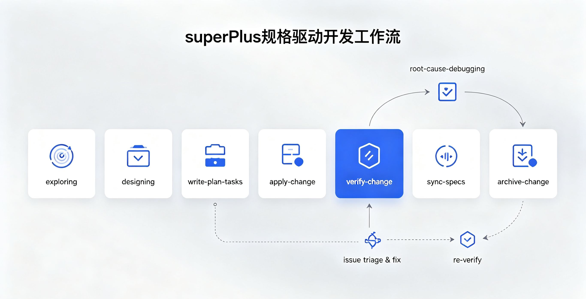
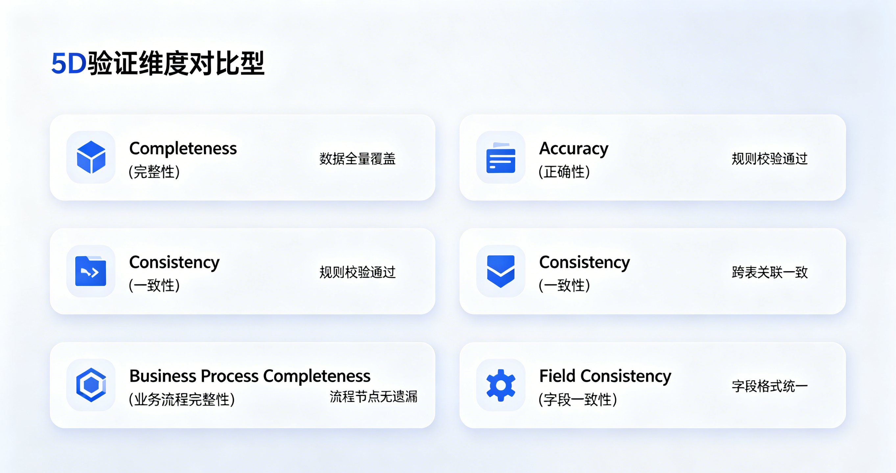
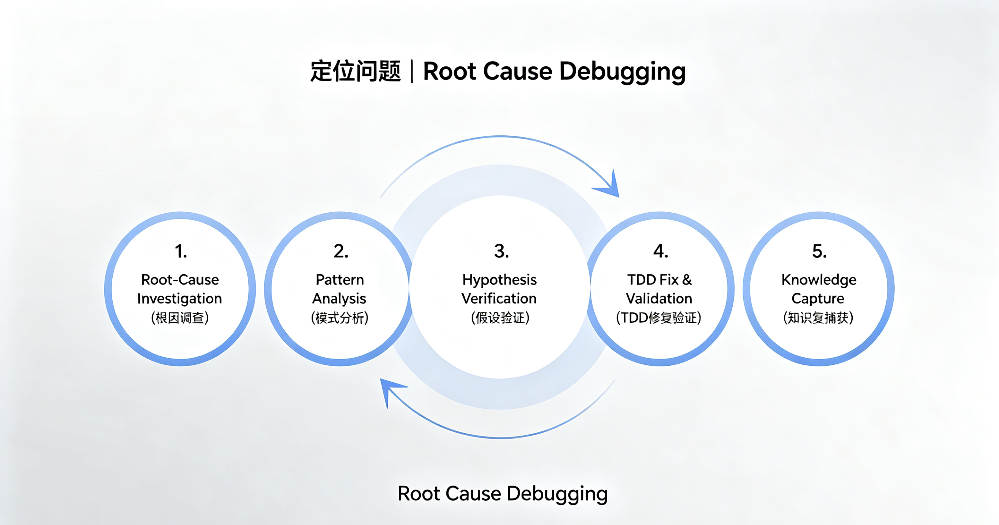

<p align="center">
  
</p>

# superPlus — AI-Native Spec-Driven Development Kit

superPlus 是一个**规格驱动开发工作流**，融合了 OpenSpec 的 artifact-driven 方法与 Superpowers 的行为塑造技能。它提供 7 个核心工作流技能 + 5 个辅助技能，覆盖完整的开发生命周期：探索 → 设计 → 规划 → 实现（TDD）→ 验证 → 同步 → 归档。

## 工作流

```
exploring ──→ designing ──→ write-plan-tasks ──→ apply-change ──→ verify-change ──→ sync-specs ──→ archive-change
(explore)     (design)      (proposal + plan)   (TDD + execute)   (5D validate)     (merge specs)    (finalize)
                                                                       │
                                                                       ▼
                                                              root-cause-debugging
                                                               (issues triage & fix)
                                                                       │
                                                                       ▼
                                                                   re-verify
```



## 核心技能

| 技能 | 触发时机 | 核心产出 |
|------|----------|---------|
| `exploring` | 需求不明确 | 探索摘要（对话中），为设计铺路 |
| `designing` | 需求明确或探索完成 | 设计文档 (`docs/designs/`)，含架构、决策、范围 |
| `write-plan-tasks` | 设计获批 | 全套制品：proposal + specs + plan + tasks (`docs/changes/<name>/`) |
| `apply-change` | 任务就绪 | 子代理并行 TDD 实现 + 两阶段审查，测试通过 |
| `verify-change` | 实现完成 | 5D 验证报告 + Issues Triage（发现问题自动接入 `root-cause-debugging` 修复回路） |
| `sync-specs` | 验证通过 | 智能合并 delta specs → 主规格 (`docs/specs/`) |
| `archive-change` | 全部完成 | 变更归档 (`docs/changes/archive/`) |

## 辅助技能

| 技能 | 用途 |
|------|------|
| `root-cause-debugging` | 系统化调试（5 阶段：根因调查 → 模式分析 → 假设验证 → TDD 修复 → 知识捕获）。被 `verify-change` 发现 CRITICAL 问题后自动接入修复回路 |
| `test-driven-development` | TDD 红-绿-重构循环。测试先行，没有失败测试就没有实现代码 |
| `using-git-worktrees` | 隔离工作区管理，保护主分支不被变更污染。被 `apply-change` 在实现前调用 |
| `writing-skills` | 创建/编辑技能文档（将 TDD 纪律应用于文档编写） |
| `using-superplus` | 入口技能。定义 skill 调用纪律："哪怕只有 1% 的可能性，也必须检查技能是否适用" |

## 特色

superPlus 的定位很明确：**同时补上 OpenSpec 和 Superpowers 的短板，并加入两者都没有的关键能力。**

| 维度 | OpenSpec | Superpowers | **superPlus** |
|------|----------|-------------|---------------|
| **Spec 能力** | ⭐⭐⭐ 核心优势，artifact DAG | ⭐ 较弱，缺乏完整 spec 体系 | ⭐⭐⭐ 完整 spec 管道：proposal → specs → plan → tasks |
| **编码能力** | ⭐ 较弱，无实现技能 | ⭐⭐⭐ 核心优势，TDD 驱动 | ⭐⭐⭐ 子代理并行 TDD + 两阶段审查 |
| **调试能力** | ❌ 无 | ⭐⭐ systematic-debugging | ⭐⭐⭐ `root-cause-debugging`：5 阶段 + todo 跟踪 + 知识捕获 + 验证回路自动触发 |
| **验证能力** | ⭐⭐⭐ 3D 验证（完备/正确/一致） | ❌ 无 | ⭐⭐⭐⭐ 5D 验证（+ 业务流完整性 + 字段一致性）+ 7 轮交叉检查 |
| **归档梳理** | ⭐ sync-specs 基本合并，无 archive | ❌ 无 | ⭐⭐⭐ sync-specs 智能合并 + 冲突检测 + archive-change 完整归档 |

### 规格驱动 + 编码实现，不留缺口

OpenSpec 擅长需求分析但不碰实现，Superpowers 擅长实现但不强调 spec。superPlus 用一套完整的制品管道把两端串起来：

```
proposal.md ──→ specs/*.md ──→ plan.md ──→ tasks.md ──→ code (TDD)
   (为什么)       (做什么)       (怎么做)     (步骤)       (实现)
```

且每个步骤都不能跳过——没有 plan 不能写 tasks，没有 tasks 不能写代码。

### 5D 验证 + 7 轮交叉检查

在 OpenSpec 3D 验证基础上扩展了 2 个维度，执行 7 轮检查（2 轮全局 + 5 轮聚焦）：

| 维度 | 聚焦 | 典型发现 |
|------|------|---------|
| **Completeness**（完整性） | 任务完成度、spec 覆盖率 | 未实现的需求、缺失的测试 |
| **Correctness**（正确性） | 需求-实现映射、场景覆盖、跨任务一致性 | 实现偏离 spec、未覆盖的边界场景 |
| **Coherence**（一致性） | 设计决策遵从、架构一致性 | 实现不符合设计、层边界被破坏 |
| **Business Flow Integrity**（业务流完整性） | 状态机、异常路径、业务规则 enforcement | 死状态、缺少回滚、规则只在 UI 层校验 |
| **Field Consistency**（字段一致性） | 全链路字段追踪（前端→API→Service→DAO→DB） | 字段丢失、命名漂移、类型不匹配 |



### 根因分析技能 — 调试 + 归档一体

这是 superPlus 独有的差异化能力。`root-cause-debugging` 不只是修 bug，它是一个完整的**调查 → 修复 → 归档**闭环：

```
verify-change ──→ 发现问题 ──→ root-cause-debugging ──→ re-verify
                                       │
                                 Phase 1-3: 根因调查
                                 Phase 4:    TDD 修复 + 3D 验证
                                 Phase 5:    知识捕获（更新 specs / 加调试注释 / 提交）
```



相比 Superpowers 的 `systematic-debugging`，`root-cause-debugging` 新增了：

- **todo 跟踪** — 进入技能即创建进度看板，防止中断后丢失上下文
- **知识沉淀询问** — 修复完成后主动询问是否将发现写入 specs / design / debug notes
- **验证回路自动触发** — 被 `verify-change` 发现 CRITICAL 问题时自动调用，无需人工选择

### 子代理并行 TDD

`apply-change` 按依赖图自动调度子代理：

- **独立组件** → 并行执行
- **共享基础设施** → 先实现后并行
- **每个任务** → TDD 纪律（失败测试 → 实现 → 全量测试）
- **两阶段审查** → spec 合规审查 → 代码质量审查

这在多文件变更中显著加速，同时保持每个单元的测试覆盖率。

### 一键制品生成

`write-plan-tasks` 将设计文档自动转化为全套实施制品，然后由独立 reviewer subagent 审查，确保设计未被曲解。

### 智能 Spec 合并

`sync-specs` 具备冲突检测、增量合并、自动验证完整性——不是简单的文件复制。

### 完整归档链路

`archive-change` 是收尾闭环：验证 sync 状态 → 确认无遗留 CRITICAL → 归档到 `docs/changes/archive/`。OpenSpec 和 Superpowers 都没有这一步。

## 安装

### OpenCode（插件方式）

在 `opencode.json` 中添加：

```json
{
  "plugin": ["./superPlus/superPlus"]
}
```

或从 git 远程源：

```json
{
  "plugin": ["superplus@git+https://github.com/xcyxiaoxiang/superplus.git"]
}
```

安装后在 TUI 中输入 `/sp-<skill>` 即可直接调用，输入 `/` 可见完整命令列表，如 `/sp-exploring`、`/sp-designing`。

### 其他平台（全局安装）

**Claude Code:**
```bash
/plugin marketplace add xcyxiaoxiang/superplus
/plugin install superplus@superplus
```

**Codex CLI:**
```bash
codex plugin marketplace add xcyxiaoxiang/superplus
codex /plugins   # → 选择 superPlus 市场 → 安装
```

**Cursor:**
```bash
git clone https://github.com/xcyxiaoxiang/superplus.git ~/projects/superPlus
ln -s ~/projects/superPlus/skills ~/.cursor/skills/superplus
```

各平台项目级安装方式见对应目录：`.claude-plugin/`、`.codex-plugin/`、`.cursor-plugin/`。

## 项目结构

```
superPlus/
├── skills/              # 12 个技能（7 核心 + 5 辅助）
├── templates/           # 4 个模板（proposal/delta-spec/plan/tasks）
├── hooks/               # 跨平台 session-start hook
├── scripts/             # 辅助脚本
├── .opencode/           # OpenCode 插件配置
├── .claude-plugin/      # Claude Code 插件配置
├── .codex-plugin/       # Codex 插件配置
├── .cursor-plugin/      # Cursor 插件配置
├── AGENTS.md            # 完整项目参考文档
├── CLAUDE.md            # Claude Code 快速指南
└── package.json         # 插件入口
```

## 约定

- **变更命名**：kebab-case，以动词开头（add/fix/update/remove/optimize）
- **设计文档**：`docs/designs/YYYY-MM-DD-<topic>-design.md`
- **主规格**：`docs/specs/<capability>/spec.md`
- **变更产物**：`docs/changes/<name>/{proposal,specs/*,plan,tasks}.md`
- **归档**：`docs/changes/archive/YYYY-MM-DD-<name>/`
- **TDD**：始终先写失败测试，再实现，再验证
- **所有产物必需**：每个变更必须包含 proposal + specs + plan + tasks
## 起源

superPlus 融合了：
- **OpenSpec**（artifact DAG、3D 验证、智能增量合并）
- **Superpowers**（子代理驱动开发、TDD、systematic debugging）

superPlus 是独立的工作流套件，不依赖也不扩展任一项目。

## 致谢 

superPlus 的设计深受以下开源项目的启发：

- **OpenSpec** — [github.com/Fission-AI/OpenSpec](https://github.com/Fission-AI/OpenSpec)，MIT License，Copyright (c) 2025 Fission AI
- **Superpowers** — [github.com/obra/superpowers](https://github.com/obra/superpowers)，MIT License，Copyright (c) 2025 Jesse Vincent

## License

MIT
