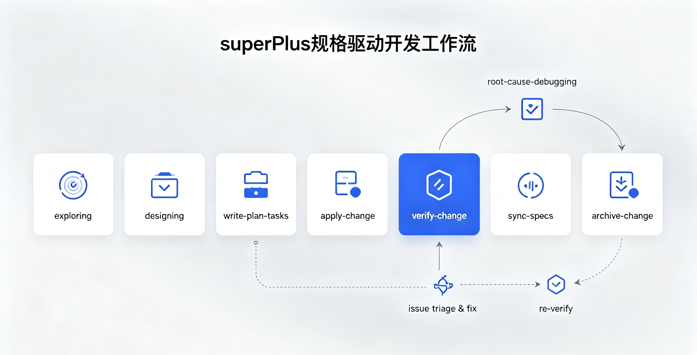
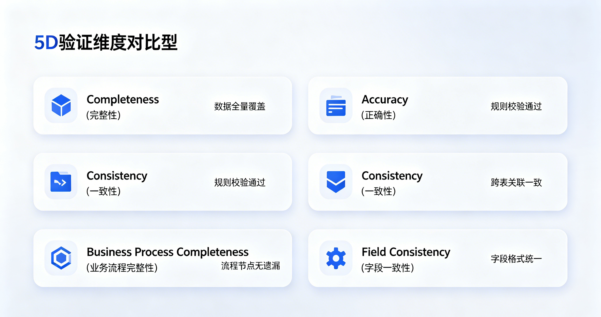
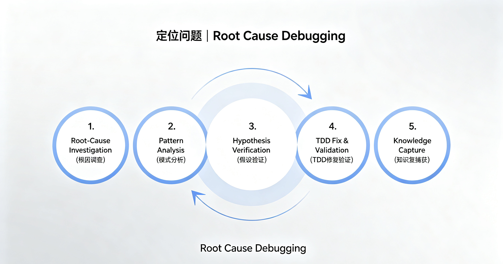

<p align="center">
  
</p>

# superPlus — AI-Native Spec-Driven Development Kit

superPlus 是一个**规格驱动开发工作流**，融合了 OpenSpec 的 artifact-driven 方法与 Superpowers 的行为塑造技能。它提供 8 个核心工作流技能 + 5 个辅助技能，覆盖完整的开发生命周期。

## 工作流

```
exploring ──→ designing ──→ write-plan-tasks ──→ apply-change ──→ verify-change ──→ sync-specs ──→ archive-change
(explore)     (design)      (specs + tasks)     (TDD + execute)   (5D validate)     (merge specs)    (finalize)
                                                                        │
                                                                        ▼
                                                               root-cause-debugging
                                                                (issues triage & fix)
                                                                        │
                                                                        ▼
                                                                    re-verify

quick-change ──→ 4 步浓缩流程（Quick Spec → Implement → Verify → Finalize）
（适合小型变更）
```



## 核心技能

| 技能 | 触发时机 | 核心产出 |
|------|----------|---------|
| `exploring` | 需求不明确 | 探索摘要（对话中），为设计铺路 |
| `designing` | 需求明确或探索完成 | 设计文档 (`docs/changes/<topic>/design.md`)，含架构、决策、范围 |
| `write-plan-tasks` | 设计获批 | 全套制品：specs + tasks (`docs/changes/<name>/`) |
| `apply-change` | 任务就绪 | 子代理并行 TDD 实现 + 两阶段审查，测试通过 |
| `verify-change` | 实现完成 | 5D 验证报告 + Issues Triage（发现问题自动接入 `root-cause-debugging` 修复回路） |
| `sync-specs` | 验证通过 | 智能合并 delta specs → 主规格 (`docs/specs/`) |
| `archive-change` | 全部完成 | 变更归档 (`docs/changes/archive/`) |
| `quick-change` | 小型变更 | 4 步浓缩流程：Quick Spec → Implement → Verify → Finalize |

## 辅助技能

| 技能 | 用途 |
|------|------|
| `root-cause-debugging` | 系统化调试（5 阶段：根因调查 → 模式分析 → 假设验证 → TDD 修复 → 知识捕获）。被 `verify-change` 发现 CRITICAL 问题后自动接入修复回路 |
| `test-driven-development` | TDD 红-绿-重构循环。测试先行，没有失败测试就没有实现代码 |
| `using-git-worktrees` | 隔离工作区管理，保护主分支不被变更污染。被 `apply-change` 在实现前调用 |
| `writing-skills` | 创建/编辑技能文档（将 TDD 纪律应用于文档编写） |
| `using-superplus` | 入口技能。定义 skill 调用纪律："哪怕只有 1% 的可能性，也必须检查技能是否适用" |

## 特色

superPlus 的定位很明确：**同时补上 OpenSpec 和 Superpowers 的短板，并加入两者都没有的关键能力。**

| 维度 | OpenSpec | Superpowers | **superPlus** |
|------|----------|-------------|---------------|
| **Spec 能力** | ⭐⭐⭐ 核心优势，artifact DAG | ⭐ 较弱，缺乏完整 spec 体系 | ⭐⭐⭐ 完整 spec 管道：specs → tasks |
| **编码能力** | ⭐ 较弱，无实现技能 | ⭐⭐⭐ 核心优势，TDD 驱动 | ⭐⭐⭐ 子代理并行 TDD + 两阶段审查 |
| **调试能力** | ❌ 无 | ⭐⭐ systematic-debugging | ⭐⭐⭐ `root-cause-debugging`：5 阶段 + todo 跟踪 + 知识捕获 + 验证回路自动触发 |
| **验证能力** | ⭐⭐⭐ 3D 验证（完备/正确/一致） | ❌ 无 | ⭐⭐⭐⭐ 5D 验证（+ 业务流完整性 + 字段一致性）+ 7 轮交叉检查 |
| **归档梳理** | ⭐ sync-specs 基本合并，无 archive | ❌ 无 | ⭐⭐⭐ sync-specs 智能合并 + 冲突检测 + archive-change 完整归档 |

### 规格驱动 + 编码实现，不留缺口

OpenSpec 擅长需求分析但不碰实现，Superpowers 擅长实现但不强调 spec。superPlus 用一套完整的制品管道把两端串起来：

```
specs/*.md ──→ tasks.md ──→ code (TDD)
   (做什么)     (怎么做+步骤)  (实现)
```

且每个步骤都不能跳过——没有 specs 不能写 tasks，没有 tasks 不能写代码。

### 5D 验证 + 7 轮交叉检查

在 OpenSpec 3D 验证基础上扩展了 2 个维度，执行 7 轮检查（2 轮全局 + 5 轮聚焦）：

| 维度 | 聚焦 | 典型发现 |
|------|------|---------|
| **Completeness**（完整性） | 任务完成度、spec 覆盖率 | 未实现的需求、缺失的测试 |
| **Correctness**（正确性） | 需求-实现映射、场景覆盖、跨任务一致性 | 实现偏离 spec、未覆盖的边界场景 |
| **Coherence**（一致性） | 设计决策遵从、架构一致性 | 实现不符合设计、层边界被破坏 |
| **Business Flow Integrity**（业务流完整性） | 状态机、异常路径、业务规则 enforcement | 死状态、缺少回滚、规则只在 UI 层校验 |
| **Field Consistency**（字段一致性） | 全链路字段追踪（前端→API→Service→DAO→DB） | 字段丢失、命名漂移、类型不匹配 |



### 根因分析技能 — 调试 + 归档一体

这是 superPlus 独有的差异化能力。`root-cause-debugging` 不只是修 bug，它是一个完整的**调查 → 修复 → 归档**闭环：

```
verify-change ──→ 发现问题 ──→ root-cause-debugging ──→ re-verify
                                       │
                                 Phase 1-3: 根因调查
                                 Phase 4:    TDD 修复 + 3D 验证
                                 Phase 5:    知识捕获（更新 specs / 加调试注释 / 提交）
```



相比 Superpowers 的 `systematic-debugging`，`root-cause-debugging` 新增了：

- **todo 跟踪** — 进入技能即创建进度看板，防止中断后丢失上下文
- **知识沉淀询问** — 修复完成后主动询问是否将发现写入 specs / design / debug notes
- **验证回路自动触发** — 被 `verify-change` 发现 CRITICAL 问题时自动调用，无需人工选择

### 两条路径：按需选择

superPlus 提供两条路径，按变更规模自动选择：

| 路径 | 步骤数 | 制品格式 | 适合场景 |
|------|--------|---------|---------|
| **全流程** | 7 步 | 2 件套（specs + tasks） | 中大型需求、新功能 |
| **`/sp-quick-change`** | 4 步 | 单文件 `1.change.md` | 小型改动（加字段、改校验、修小 bug） |

### 一键制品生成

`write-plan-tasks` 将设计文档自动转化为全套实施制品，然后由独立 reviewer subagent 审查，确保设计未被曲解。

### 智能 Spec 合并

`sync-specs` 具备冲突检测、增量合并、自动验证完整性——不是简单的文件复制。

### 完整归档链路

`archive-change` 是收尾闭环：验证 sync 状态 → 确认无遗留 CRITICAL → 归档到 `docs/changes/archive/`。OpenSpec 和 Superpowers 都没有这一步。

### 全流程制品管道

从设计到实现的完整链：

```
   ┌──────────┐
   │ 设计文档  │  docs/changes/<topic>/design.md
   └────┬─────┘
        │ write-plan-tasks
        ▼
   ┌──────────────┐
   │ 1.specs/     │  做什么（What）—— delta 规格，按能力分目录
   ├──────────────┤
   │ 2.tasks      │  怎么做+步骤（How + Steps）—— 架构方案 + 可执行任务列表
   └────┬─────────┘
        │ apply-change（TDD）
        ▼
   ┌──────────┐
   │  code     │  实现代码（测试通过）
   └────┬─────┘
        │ verify-change → sync-specs
        ▼
   ┌──────────┐
   │ 主规格库   │  docs/specs/<capability>/spec.md
   └──────────┘
```

每个步骤不能跳过。没有 specs 不能写 tasks，没有 tasks 不能写代码。

**quick-change** 使用简化管道：单文件 `1.change.md`（合并 specs + tasks），其余步骤一致。

### 子代理调度模型

`apply-change` 根据 `2.tasks.md` 的依赖图智能调度子代理：

```
                    2.tasks.md
                        │
                 依赖图分析
                   ╱      ╲
         独立任务          共享依赖
         并行 dispatch     先串行后并行
          ╱    ╲               │
      @fixer  @fixer        @fixer
       (TDD)   (TDD)         (TDD)
          ╲    ╱               │
          合并验证 ←───────────┘
              │
         spec 合规审查 ─→ 代码质量审查
              │
          全部测试通过
```

- **独立组件** → 并行执行
- **共享基础设施** → 先实现后并行
- **每个任务** → TDD 纪律（失败测试 → 实现 → 全量测试）
- **两阶段审查** → spec 合规审查 → 代码质量审查

### 宏观工作流全景

```
                ┌────────────────── 核心 7 步 ──────────────────┐
                │                                                │
  exploring ──→ designing ──→ write-plan-tasks ──→ apply-change ──→ verify-change ──→ sync-specs ──→ archive-change
  (探索需求)     (设计架构)     (生成制品)           (TDD 实现)      (5D 验证)          (合并规格)      (归档收尾)
                    │               │                     │              │
                    ▼               ▼                     ▼              ▼
          docs/changes/<topic>/  docs/changes/<name>/    src/ code    docs/specs/
                                                                          │
                                                                          ▼
                                                                   docs/changes/archive/

quick-change ──→ 4 步浓缩：Quick Spec → Implement → Verify → Finalize（适合小型变更）
```

| 路径 | 适用场景 | 步骤数 | 制品 |
|------|---------|--------|------|
| **全流程** | 中大型需求 | 7 步 | 2 件套 (specs + tasks) |
| **quick-change** | 小型改动（加字段、改校验、修小 bug） | 4 步 | 单文件 `1.change.md` |

## 安装

### OpenCode（插件方式）

在 `opencode.json` 中添加：

```json
{
  "plugin": ["./superPlus/superPlus"]
}
```

或从 git 远程源：

```json
{
  "plugin": ["superplus@git+https://github.com/xcyxiaoxiang/superplus.git"]
}
```

安装后在 TUI 中输入 `/sp-<skill>` 即可直接调用，输入 `/` 可见完整命令列表，如 `/sp-exploring`、`/sp-designing`。

### 其他平台（全局安装）

**Claude Code:**
```bash
/plugin marketplace add xcyxiaoxiang/superplus
/plugin install superplus@superplus
```

**Codex CLI:**
```bash
codex plugin marketplace add xcyxiaoxiang/superplus
codex /plugins   # → 选择 superPlus 市场 → 安装
```

**Cursor:**
```bash
git clone https://github.com/xcyxiaoxiang/superplus.git ~/projects/superPlus
ln -s ~/projects/superPlus/skills ~/.cursor/skills/superplus
```

各平台项目级安装方式见对应目录：`.claude-plugin/`、`.codex-plugin/`、`.cursor-plugin/`。

## 项目结构

```
superPlus/
├── skills/              # 13 个技能（8 核心 + 5 辅助）
├── hooks/               # 跨平台 session-start hook
├── scripts/             # 辅助脚本
├── .opencode/           # OpenCode 插件配置
├── .claude-plugin/      # Claude Code 插件配置
├── .codex-plugin/       # Codex 插件配置
├── .cursor-plugin/      # Cursor 插件配置
├── AGENTS.md            # 完整项目参考文档
├── CLAUDE.md            # Claude Code 快速指南
└── package.json         # 插件入口
```

## 约定

- **设计文档**：`docs/changes/<topic>/design.md` — topic 为 kebab-case
- **主规格**：`docs/specs/<capability>/spec.md`
- **变更产物**：`docs/changes/<name>/{design.md,1.specs/*,2.tasks}.md`
- **归档**：`docs/changes/archive/YYYY-MM-DD-<name>/`
- **TDD**：始终先写失败测试，再实现，再验证
- **所有产物必需**：每个变更必须包含 specs + tasks
## 起源

superPlus 融合了：
- **OpenSpec**（artifact DAG、3D 验证、智能增量合并）
- **Superpowers**（子代理驱动开发、TDD、systematic debugging）

superPlus 是独立的工作流套件，不依赖也不扩展任一项目。

## 致谢 

superPlus 的设计深受以下开源项目的启发：

- **OpenSpec** — [github.com/Fission-AI/OpenSpec](https://github.com/Fission-AI/OpenSpec)，MIT License，Copyright (c) 2025 Fission AI
- **Superpowers** — [github.com/obra/superpowers](https://github.com/obra/superpowers)，MIT License，Copyright (c) 2025 Jesse Vincent

## 版本记录

### v1.0.0 — 核心工作流重构 (2026-07-13)

从 v0.2.2 到 v1.0.0 是一次全面的核心工作流重构。变更范围覆盖 write-plan-tasks、apply-change、verify-change 三个核心技能。

**工作流精简：**
- **删除 proposal/plan 工件**，4 → 2 工件（specs + tasks）
- 原 proposal（design 摘要）和 plan（执行计划）的信息合并到 tasks.md 头部
- 审阅节点从 5 个减少到 3 个（design → specs → tasks）

**tasks.md 模板强化：**
- 头部从 7 个 section 扩展到 **9 个**：新增 **Domain Context**（业务领域信息）和 **Reference Code**（参考代码片段）
- 现有 section 全部子结构化（Architecture → Component Responsibilities + Key Interfaces；Cross-Cutting → Error Handling / Logging / Configuration / Coding Conventions 等）
- **模板即最低标准** — 子结构不可留空，controller 不再自行判断"够不够详细"

**子代理上下文注入重构：**
- implementer prompt 从 **7 个必填字段扩展到 9 个**：新增 Domain Context + Reference Code
- 新增 **Controller Checklist**（11 项），确保上下文字段不遗漏
- spec-reviewer 和 code-quality-reviewer prompt 模板从简化版升级为完整版
- 所有 prompt 模板改为**英文**（面向子代理的统一语言）

**verify-change 集成 design doc：**
- Step 1 artifact 表格从 2 个扩展到 **3 个**（tasks.md + design doc + specs）
- D3 Coherence 重写为 4 层验证：Design Intent → Design Adherence → Architectural Consistency → Risk Mitigation
- D4 Business Flow 新增 design doc 作为权威流程来源
- Graceful Degradation 表格从 2 行扩展到 4 行

**其他修复：**
- root-cause-debugging Phase 3.5 → Phase 4 重编号完成
- `using-superplus` "6-step" → "7-step" 修正
- 全项目过时引用清理（proposal/plan 残留、数字错误）

### v0.2.2 — Quick-Change 技能 (2026-06-23)

- **新增** `quick-change` 技能 — 4 步浓缩流程（Quick Spec → Implement → Verify → Finalize），用于加字段、改校验、修小 bug 等小型变更
- **新增** `/sp-quick-change` 斜杠命令
- **新增** `docs/specs/quick-change/spec.md` 主规格
- **改进** 模板文件重命名加序号（`1.delta-spec.md` + `2.tasks.md`）
- **改进** `templates/` 迁移至 `skills/write-plan-tasks/templates/`
- **改进** 产出物路径同步加序号
- **文档** AGENTS.md / README.md / CLAUDE.md 同步

### v0.2.1 — 命令与插件 (2026-06-21)

- **新增** OpenCode plugin 机制，通过 `config` hook 自动注册 skills 路径
- **新增** 12 个 `/sp-*` 斜杠命令，支持在 TUI 中直接调用 superPlus 技能
- **新增** Logo 集成
- **改进** 命令改为对话流内执行（移除 `subtask: true`）
- **改进** 模板支持 `$ARGUMENTS` 捕获用户附加文本
- **文档** 四平台 INSTALL.md 统一精简，README 同步

## License

MIT
