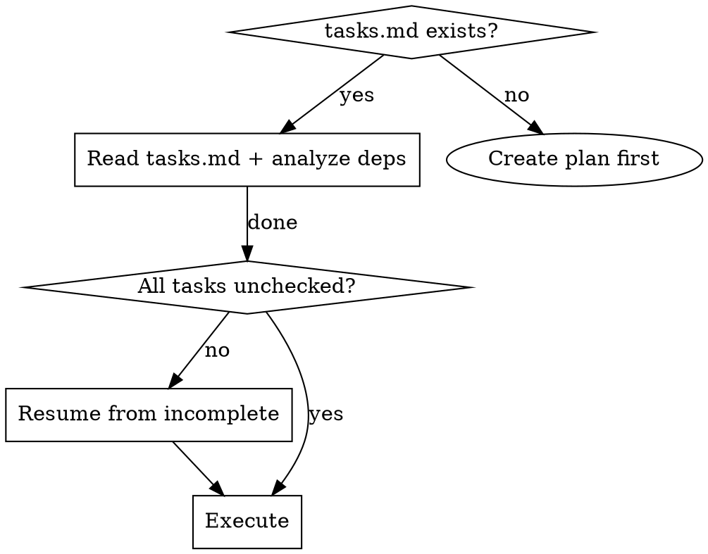

# Apply-Change — Subagent-Driven TDD Implementation

Implement all tasks from a change plan by dispatching subagents with TDD discipline and two-stage review (spec compliance → code quality) after each task.

**Announce at start:** "I'm using the apply-change skill to implement tasks with subagent-driven TDD."

**Context:** Run after `write-plan-tasks` has created the complete artifacts including `tasks.md`. The change directory is `docs/changes/<name>/`.

**Continuous execution:** Do not pause between tasks. Execute all tasks without stopping. Only stop for: BLOCKED status you cannot resolve, genuine ambiguity, or all tasks complete.

**Next step in the current process:** Remind the user to call `verify-change` to validate the specifications.


---

## When to Use



---

## The Process

### Step 0: Read and Analyze Tasks

Read `docs/changes/<name>/tasks.md`. Identify:

- **Total tasks** — count checkboxes `- [ ]`
- **Already completed** — count `- [x]`
- **Dependency graph** — which tasks depend on others

**Dependency analysis rules:**
- Same file/component → likely dependent → **sequential**
- Different files/components → likely independent → **parallel**
- One task creates what another reads → dependent → **sequential**
- Same test file → sequential within that file
- Shared infrastructure (config, types, interfaces) → implement first, then dependents in parallel

Build the execution plan:
```
Group 1 (parallel):  Task A, Task B, Task C
       ↓
Group 2 (parallel):  Task D, Task E
       ↓
Group 3 (sequential): Task F (depends on D+E)
```

### Step 1: Dispatch Implementation

Dispatch one subagent per independent task, or one at a time for dependent tasks (wait for completion before the next).

**Subagent dispatch template:**

```markdown
## Objective
Implement Task N: <task name>

## Task Description
<FULL TEXT of task from tasks.md — paste it, don't make subagent read file>

## Context
- Change directory: docs/changes/<name>/
- Existing code structure: <brief summary>
- Dependencies: <what's already implemented>
- What this task connects to: <upstream/downstream context>

## Rules
1. TDD: write failing test → verify fails → write implementation → verify passes
2. Each task should be 1-3 file edits max
3. Do NOT modify files outside this task's scope

## Report Format
When done, report:
- **Status:** DONE | DONE_WITH_CONCERNS | BLOCKED | NEEDS_CONTEXT
- What you implemented
- Tests written and results
- Files changed
- Any concerns or blockers
```

### Step 2: TDD Requirements

**Every task MUST follow TDD order:**

| Step | Action | Verification |
|------|--------|-------------|
| 1 | Write the FAILING test | Run project test command → FAIL |
| 2 | Write minimal implementation | Run project test command → PASS |
| 3 | Run ALL tests (not just new one) | Run project test command → ALL PASS |

**TDD is non-negotiable.** The test-first discipline ensures the implementation satisfies the spec.

### Step 3: Two-Stage Review (per task)

After each subagent completes implementation:

#### Stage 1: Spec Compliance Review

**Before dispatching:**
1. Identify the relevant spec file: `docs/changes/<name>/specs/<capability>/spec.md`
2. Read it and extract the requirement sections that this task implements
3. Inject the extracted spec text into the `[Original Specification]` block in `spec-reviewer-prompt.md`

This gives the reviewer the **authoritative spec text** (not just the task description) as reference, preventing translation drift between specs → tasks → review.

Dispatch a spec reviewer subagent using `./spec-reviewer-prompt.md`.

**Reviewer verifies (against spec, not just task text):**
- All requirements implemented (nothing missing)
- Any spec constraints (thresholds, edge cases, error conditions) handled
- No extra/unneeded features added (YAGNI)
- Requirements interpreted correctly — flag if task description drifted from spec
- Implementation matches intent, not just letter

**If spec review fails:**
- Same subagent fixes the gaps
- Re-review until ✅

#### Stage 2: Code Quality Review

**Only after spec compliance passes.** Dispatch a code quality reviewer using `./code-quality-reviewer-prompt.md`.

**Reviewer checks:**
- Clean, maintainable code
- Each file has one clear responsibility
- Units decomposed for independent understanding/testing
- No new large files or significant growth of existing files

**If quality review fails:**
- Same subagent fixes quality issues
- Re-review until approved

### Step 4: Handling Subagent Status

Subagents report one of four statuses. Handle each appropriately:

**DONE:** Proceed to two-stage review.

**DONE_WITH_CONCERNS:** Work completed but implementer flagged doubts. Read concerns before proceeding. If about correctness/scope, address before review. If observations (e.g., "file getting large"), note and proceed.

**NEEDS_CONTEXT:** Implementer needs information not provided. Provide missing context and re-dispatch.

**BLOCKED:** Implementer cannot complete the task. Assess the blocker:
1. Context problem → provide more context, re-dispatch same model
2. Needs more reasoning → re-dispatch with more capable model
3. Task too large → break into smaller pieces
4. Plan is wrong → escalate to human

**Never** ignore escalation or retry same model without changes.

### Step 5: Checkpoint Verification

After each task group completes:

1. **Run full test suite** — verify no regressions
2. **Update tasks.md** — mark checkbox `- [x]` for completed tasks
3. **Check `git status`** — verify files are tracked

If tests fail:
- Identify regression cause
- If from different task group, flag the conflict
- If within current group, fix before proceeding

### Step 6: Final Integration and Handoff

When all tasks complete:

1. **Final full test run** — entire test suite passes
2. **Spec audit** — each requirement in `docs/changes/<name>/specs/**/spec.md` is either implemented (→ test exists) or explicitly deferred
3. **`git diff --stat`** — review total change scope（optional）

Announce results:

```
Tasks implemented: X/Y complete
Tests: all passing (N tests)
Files changed: M files, +A -B lines
Change: docs/changes/<name>/

Ready for verify-change.
```

**Next step:** Invoke `verify-change` to validate against specs.

---

## Prompt Templates

| Template | Purpose |
|----------|---------|
| `./implementer-prompt.md` | Dispatch implementer subagent |
| `./spec-reviewer-prompt.md` | Dispatch spec compliance reviewer |
| `./code-quality-reviewer-prompt.md` | Dispatch code quality reviewer |

---

## Integration

| Skill | Integration Point |
|-------|-------------------|
| `write-plan-tasks` | **Required previous step** — provides tasks.md |
| `verify-change` | **Required next step** — validates entire implementation |
| `using-git-worktrees` | Ensures isolated workspace before starting |
| `templates/tasks.md` | Task format reference |

---

## Validation

Before handing off to verify-change, confirm:

- [ ] All tasks checked off in tasks.md
- [ ] Full test suite passes
- [ ] No untracked new files left unstaged
- [ ] Each spec requirement has a corresponding test
- [ ] No production code added without a matching test
- [ ] Both review stages passed for every task

---

## Red Flags

**Never:**
- Skip TDD — write test first, always
- Skip either review stage (spec compliance OR code quality)
- Start code quality review before spec compliance is ✅
- Modify specs or design docs during implementation (create a follow-up change)
- Cross task boundaries without verifying dependencies
- Leave tests failing between tasks
- Implement something not in the spec (YAGNI)
- Dispatch parallel subagents for dependent tasks (causes conflicts)
- Let implementer self-review replace actual review (both are needed)
- Skip review loops (reviewer found issues = fix = re-review)
- Ignore subagent questions (answer before letting them proceed)
- Accept "close enough" on spec compliance

**If subagent asks questions:**
- Answer clearly and completely
- Provide additional context if needed
- Don't rush them into implementation

**If reviewer finds issues:**
- Implementer (same subagent) fixes them
- Reviewer reviews again
- Repeat until approved

**If subagent fails:**
- Dispatch fix subagent with specific instructions
- Don't try to fix manually (context pollution)
