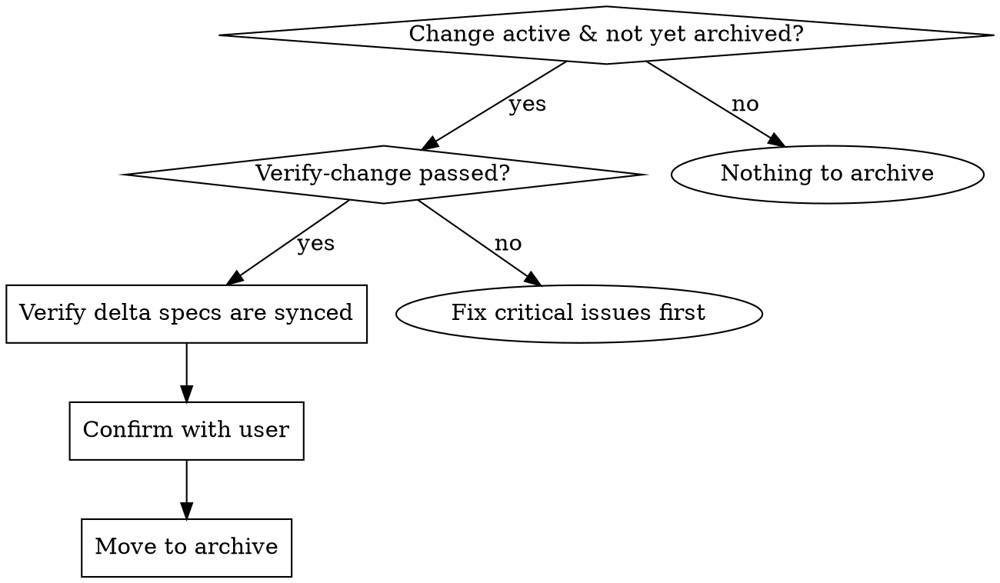

# Archive-Change — Finalize and Archive a Completed Change

Archive a completed change by moving it to `docs/changes/archive/YYYY-MM-DD-<name>/`. Validates completion, assesses sync state, and handles warnings gracefully.

**Announce at start:** "I'm using the archive-change skill to finalize and archive the change."

**Context:** Run after `sync-specs` completes, or as a self-contained finalization step if no specs to sync.

---

## When to Use



---

## The Process

### Step 1: Validate Change

**Check change directory exists and is not already archived:**
- Verify `docs/changes/<name>/` exists as a directory
- Verify `docs/changes/archive/*/<name>/` does NOT exist (already archived)

If already archived, skip with message.

**Check verify-change status:**
- Look for a verify-change report in the change directory or recent conversation
- If CRITICAL issues exist and are unresolved → warn user, suggest fixing before archive
- If no verify-change was run → warn user, recommend running verify-change first

### Step 2: Check Completion

**Artifact check:** List what artifacts exist in the change directory.

**Task completion (if tasks.md exists):**
Read `docs/changes/<name>/tasks.md`. Count:
- `- [x]` — complete
- `- [ ] ` — incomplete (note: trailing space to avoid matching `- [x]`)

**If incomplete artifacts found:**
> ⚠️ Warning: N incomplete artifacts/tasks found.
> Confirm you want to proceed anyway? [Proceed / Cancel]

**If all complete:** Proceed without warning.

### Step 3: Assess Delta Spec Sync State

Check if delta specs exist at `docs/changes/<name>/specs/`.

**If delta specs exist:**
- Read each delta spec
- Read its corresponding main spec at `docs/specs/<capability>/spec.md` (if exists)
- Compare using sync-specs conflict detection logic:
  - Check if ADDED requirements already exist in main spec
  - Check if MODIFIED requirements already have the new scenarios
  - Check if REMOVED requirements are already removed
- Determine sync state: fully synced / partially synced / not synced

**Offer choices:**
| Situation | Options |
|-----------|---------|
| Changes still needed | "Sync now (recommended)", "Archive without syncing" |
| Already synced | "Archive now", "Sync anyway", "Cancel" |

**If user chooses to sync:** Invoke sync-specs skill for this change, then proceed.

### Step 4: Perform Archive

**Generate target path:**
- Format: `docs/changes/archive/YYYY-MM-DD-<name>/`
- If target already exists, auto-append a counter suffix: `docs/changes/archive/YYYY-MM-DD-<name>-2/`, `-3/`, etc.

**Move the change:**
- Create archive directory if needed
- Move the entire `docs/changes/<name>/` directory to the target path
- Verify the move succeeded by checking target directory exists and source no longer exists

### Step 5: Display Summary

```
## Archive Complete

**Change:** <change-name>
**Archived to:** docs/changes/archive/YYYY-MM-DD-<name>/
**Specs:** ✓ Synced (or "No delta specs" or "Sync skipped")

All tasks complete.
```

**If warnings exist, add a Warnings section:**

```
**Warnings:**
- Archived with N incomplete tasks (user confirmed)
- Delta spec sync was skipped (user chose to skip)
- Verify-change had unresolved CRITICAL issues (user confirmed)
```

---

## Integration

| Skill | Integration Point |
|-------|-------------------|
| `sync-specs` | **Related** — should run first if delta specs exist |
| `verify-change` | **Required previous step** — should pass before archive |

---

## Guardrails

- **Always** prompt for confirmation before archiving (show warnings)
- **Don't block on warnings** — inform, confirm, proceed
- **Check target exists** before moving — auto-append suffix if conflict, never overwrite
- **Move the entire directory** (preserves all artifacts, nothing gets lost)
- **Show clear summary** of what happened
- **Verify move succeeded** before marking complete

---

## Red Flags

**Never:**
- Archive without checking if delta specs need syncing
- Overwrite an existing archive (always check first)
- Skip confirmation if there are incomplete tasks
- Delete the source after moving without verifying the move succeeded
- Archive a change that hasn't been fully implemented without warning
- Archive with unresolved CRITICAL verify-change issues without explicit user confirmation
