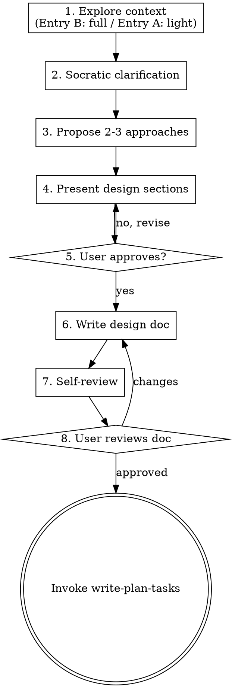

# Designing — Structure Ideas Into Actionable Plans

Take explored ideas or clear requirements and produce a validated design document.

**Announce at start:** "I'm using the designing skill to create a structured design."

**Core principle:** Design before implementing.

<HARD-GATE>
Do NOT invoke any implementation skill, write any code, scaffold any project, or take any implementation action until you have presented a design and the user has approved it. This applies to EVERY project regardless of perceived simplicity.
</HARD-GATE>

---

## Anti-Pattern: "This Is Too Simple To Need A Design"

Every project goes through this process. A todo list, a single-function utility, a config change — all of them. "Simple" projects are where unexamined assumptions cause the most wasted work. The design can be short (a few sentences for truly simple projects), but you MUST present it and get approval.

---

## Dual Entry

This skill has two entry paths. Detect which one applies from the conversation context:

| Entry | Preceded by exploring? | Start at |
|-------|----------------------|----------|
| **A** | Yes — previous conversation used the `exploring` skill | Step 1 (light: validate context) → Step 2 (Socratic clarification to confirm no gaps) |
| **B** | No — user brought clear requirements directly | Step 1 (full: explore context) → Step 2 (Socratic clarification) |

**Detection:** If the conversation already contains exploration discussion, user-stated constraints, and a rough direction → Entry A. If the user states requirements directly → Entry B. When in doubt, ask: "Have we explored this enough, or should I start by exploring the project context?"

---

## The 8-Step Process



**Terminal state:** Invoke `write-plan-tasks`. Do NOT invoke any implementation skill directly.

---

### Step 1: Explore Project Context

**Entry A (from exploring)** — Light validation. Quickly verify that the exploration phase sufficiently covered the project context. Ask:

- "From our exploration, I understand [context summary]. Is there anything we missed or that has changed?"
- If gaps are found, offer to return to exploring or address them inline.
- The goal is confirmation, not deep discovery — deep discovery should have happened in exploring.

**Entry B (direct entry)** — Full exploration. Check files, docs, recent commits to build context from scratch.

- Map existing architecture relevant to the discussion
- Find integration points — where will the new work connect?
- Surface hidden complexity — what looks simple but isn't?
- **Scope check:** If the request describes multiple independent subsystems, flag it. Help decompose into sub-projects first.

**SuperPlus context check (both entries):**

```
1. Check docs/designs/     → existing designs, avoid duplication
2. Check docs/specs/       → existing specs, align with conventions
3. Check docs/changes/          → active changes, understand current work
4. Check docs/changes/archive/  → historical context, learn from past decisions
```

---

### Step 2: Socratic Clarification (Both Entries)

Use Socratic questioning to clarify requirements. One question at a time — let the user answer fully before the next question. Keep going until no more meaningful questions remain.

Start broad, then probe deeper:

```
Why is this needed?             →  understand the core motivation
What problem does it solve?     →  define the problem boundary
Who is affected?                →  identify stakeholders and scope
What assumptions are we making? →  surface hidden constraints
What if we don't do it?         →  validate priority and necessity
What does success look like?    →  define acceptance criteria
```

- Only one question per message
- Let the user's answer guide the next question
- When no more meaningful questions remain, move to Step 3

---

### Step 3: Propose 2-3 Approaches

Present options with trade-offs and your recommendation.

**Format — use a comparison table:**

| Criterion | Option A | Option B | Option C |
|-----------|----------|----------|----------|
| Complexity | Low | Medium | High |
| Risk | Low | Medium | High |
| Flexibility | Medium | High | Low |

- Lead with your recommended option and explain why
- Surface risks — what could go wrong with each approach
- Question assumptions — including the user's and your own

---

### Step 4: Present Design Sections

Present design in sections scaled to complexity. Get approval after each section.

- Include ASCII diagrams (data flow, component relationships, state transitions)
- Cover: architecture, components, data flow, error handling, testing
- **Design for isolation** — each unit has one clear purpose, communicates through well-defined interfaces
- Surface risks per section

---

### Step 5: User Approval Gate

After all sections are presented and approved, confirm overall design approval. If the user requests changes, revise and re-present affected sections.

---

### Step 6: Write Design Doc

Save validated design to `docs/designs/YYYY-MM-DD-<topic>-design.md`.

The design doc should cover:

- **Context** — Exploration summary (if from exploring), current state, constraints
- **Problem / Goal** — What are we solving?
- **Approach** — Chosen approach with rationale (covering architecture and components)
- **Data Flow** — How data moves through the system
- **Key Decisions** — Important technical choices with rationale
- **Scope** — What's in scope and what's explicitly out
- **Risks / Trade-offs** — Known risks, trade-offs, and mitigations

The design doc feeds into `write-plan-tasks` downstream. See [Integration](#integration) for section-to-artifact mapping.

---

### Step 7: Spec Self-Review

After writing, look at it with fresh eyes:

1. **Placeholder scan:** Any "TBD", "TODO", or vague requirements? Fix them.
2. **Internal consistency:** Do any sections contradict each other?
3. **Scope check:** Is this focused enough for a single implementation plan?
4. **Ambiguity check:** Could any requirement be interpreted two ways? If so, pick one and make it explicit.

Fix issues inline. No re-review needed.

---

### Step 8: User Review Gate

Ask the user to review the written design before proceeding:

> "Design written to `docs/designs/YYYY-MM-DD-<topic>-design.md`. Please review it and let me know if you want any changes before we create the implementation plan."

Wait for response. If changes requested, make them and re-run self-review. Only proceed on approval.

---

### Step 9: Invoke write-plan-tasks

Invoke the `write-plan-tasks` skill to create detailed planning artifacts.

**Do NOT invoke any other skill.** write-plan-tasks is the only valid next step.

---

## Working in Existing Codebases

- Explore the current structure before proposing changes. Follow existing patterns.
- Where existing code has problems that affect the work, include targeted improvements as part of the design.
- Don't propose unrelated refactoring. Stay focused on what serves the current goal.

---

## Key Principles

- **One question at a time** — Don't overwhelm with multiple questions
- **YAGNI ruthlessly** — Remove unnecessary features from all designs
- **Explore alternatives** — Always consider 2-3 approaches before settling
- **Incremental validation** — Present sections, get approval before moving on
- **No implementation during design** — Thinking time is not coding time

---

## Integration

### Skills

| Skill | Integration Point |
|-------|-------------------|
| `exploring` | **Optional previous step** — provides exploration context for Entry A |
| `write-plan-tasks` | **Required next step** — generates proposal, specs, plan, and tasks |
| `using-superplus` | Bootstrap — loaded before this skill |

### Design Doc → Downstream Mapping

The design doc at `docs/designs/YYYY-MM-DD-<topic>-design.md` is consumed by `write-plan-tasks`:

| Design Doc Section | → write-plan-tasks Output |
|---|---|
| **Context** | Change-level `plan.md` context section |
| **Problem / Goal** | Proposal's **Why** |
| **Approach** (architecture + components) | Proposal's **What Changes** and **Capabilities** |
| **Data Flow** | Identifies data processing boundaries → capabilities |
| **Key Decisions** | Identifies behavior changes → modified capabilities |
| **Scope** | Proposal's **Impact** |
| **Risks / Trade-offs** | Change-level `plan.md` Key Decisions section |

The topic in the filename determines the change name:
`docs/designs/2026-05-20-add-dark-mode-design.md` → `docs/changes/add-dark-mode/`

---

## Red Flags

**Never:**
- Write code or implement features during design
- Skip design because "it's simple"
- Proceed to implementation without user design approval
- Ask multiple questions in one message
- Propose a single approach without alternatives
- Skip scope check when requirements span multiple subsystems
- Invoke implementation skills directly (must use write-plan-tasks first)
- Skip Step 1 context validation — Entry A still requires light validation
- Skip Step 2 Socratic clarification — both entries must clarify until no questions remain
- Proceed without user reviewing the written design doc

**If user says "just build it, no design needed":**
- Push back: "Every project benefits from a brief design. I can keep it short."
- If they insist, note the concern and proceed — but the HARD-GATE still requires a presented design.
