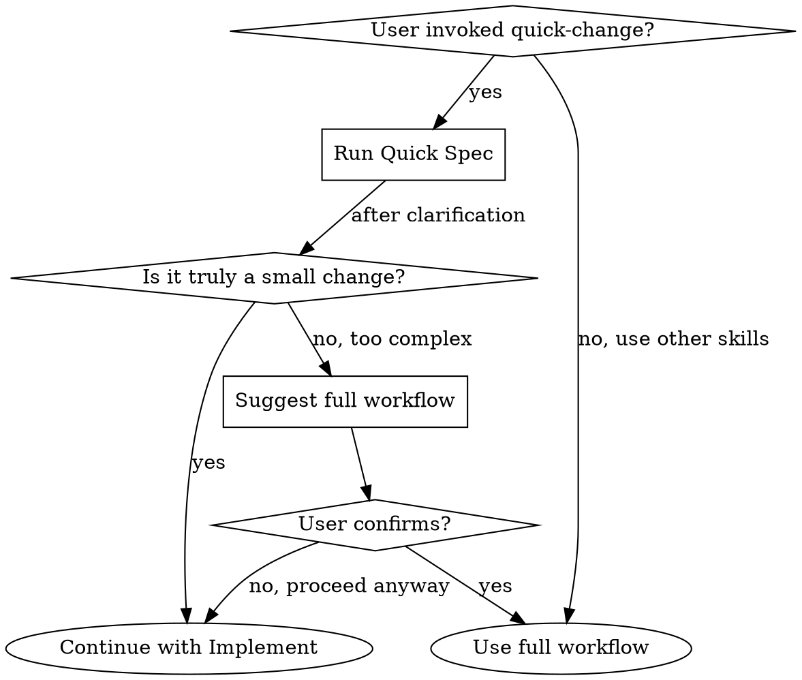

# Quick-Change — 4-Step Workflow for Small Changes

A lightweight spec-driven workflow for small, well-scoped changes. Completes the full development cycle (spec → implement → verify → archive) without the overhead of the full 7-step process.

**Announce at start:** "I'm using the quick-change skill for this small change."

**Context:** The user has explicitly invoked quick-change (via `/sp-quick-change` or equivalent). Do NOT auto-detect quick-change — only proceed when the user explicitly requests it.

**Next step after completion:** The change is fully archived. No further action needed.

---

## When to Use



**Suitable for:**
- Adding/removing fields
- Modifying validation rules
- Tuning copy, colors, or configuration
- 1-3 files, 5-50 lines of change

**Not suitable (suggest full workflow):**
- New API endpoints or pages
- Multi-step business flows
- Cross-system integration
- Architectural refactoring

---

## The 4-Step Process

```
Quick Spec ──→ Implement ──→ Verify ──→ Finalize
(clarify +    (direct code   (3D check)  (sync-specs
 1.change.md)  changes)                  + archive)
```

---

## Step 1: Quick Spec

Fully clarify the change before any implementation. "Quick" refers to the artifact format, not the thinking depth.

### Clarify Requirements

Ask targeted questions until the change is fully understood:

- What exactly needs to change? (fields, rules, behavior)
- What are the boundary conditions? (null values, edge cases, error states)
- What modules/files will be affected?
- Are there alternative approaches? Trade-offs?
- How should errors be handled?
- What existing behavior must NOT change?

Do NOT skip questions because "it's a small change." Incomplete understanding leads to incorrect implementation even for a one-line fix.

### Produce Change Artifact

Create the change directory and single artifact:

```bash
mkdir -p docs/changes/<name>
```

Write `docs/changes/<name>/1.change.md`:

```markdown
# <change-name>

## 变更描述 + 边界/影响
<What changes, boundary cases, affected modules>

## Delta Spec + 实现方案
<What specs change and how to implement>

## 任务清单
- [ ] <task 1>
- [ ] <task 2>
```

**Naming:** kebab-case, starts with verb (add/fix/update/remove/optimize).

### User Confirmation Gate

Present the `1.change.md` to the user and wait for approval before proceeding to implementation.

---

## Step 2: Implement

Implement the changes described in `1.change.md`.

### Rules

- **Direct implementation** — Make the code changes. Optionally dispatch subagents for efficiency, but skip the two-stage review (spec compliance + code quality).
- **Soft TDD** — Not required to write tests first, but:
  - If existing tests exist for the changed code, keep them passing
  - Run the full test suite after implementation — ALL tests must pass
- **Scope discipline** — Do NOT modify code outside the scope defined in `1.change.md`

### Complexity Escalation

If during implementation you discover the change is significantly more complex than expected (touches more files, requires new infrastructure, etc.):

1. Tell the user: "This change looks more complex than expected. I recommend switching to the full workflow."
2. Ask: "Keep the current changes or discard them?"
3. Let the user decide. If they proceed with quick-change anyway, continue.

---

## Step 3: Verify

Validate the implementation against three dimensions:

### 3D Verification

| Dimension | What to Check |
|-----------|---------------|
| **Correctness** | Core functionality works, edge cases covered, all tests pass |
| **Field Consistency** | Full-stack field trace (frontend → API → Service → DAO → DB) |
| **Business Flow** | Business rules still enforced, state transitions valid, no broken flows |

### Output

Print a single-line result:
- ✅ **PASS** — All checks pass, proceed to Finalize
- ⚠️ **Non-blocking issues** — Minor concerns noted, fix if trivial, proceed
- ❌ **CRITICAL** — Incorrect behavior detected, enter debug loop

### Built-in Debug Loop

When Verify finds a CRITICAL issue, do NOT exit quick-change. Instead:

```
1. Locate root cause (inspect code, data flow, test output)
2. Fix the issue
3. Run 3D Verify again
4. Repeat until:
   - All CRITICAL issues resolved → proceed to Finalize
   - OR determine the fix is too complex for quick-change → suggest full workflow
```

This loop is self-contained within the quick-change skill. Do not invoke `root-cause-debugging`.

---

## Step 4: Finalize

Complete the change by merging specs and archiving.

### Process

1. **Extract Delta Spec** — Read `1.change.md` and extract the Delta Spec section. Generate a temporary spec file at `docs/changes/<name>/specs/<capability>/spec.md`.

2. **Call `sync-specs`** — Load the `sync-specs` skill and merge the delta spec into the main spec library at `docs/specs/<capability>/spec.md`.

3. **Call `archive-change`** — Load the `archive-change` skill to archive the change to `docs/changes/archive/`.

4. **Clean up** — Remove any temporary files.

---

## Integration

| Skill | Integration Point |
|-------|-------------------|
| `sync-specs` | Called during **Finalize** to merge delta specs |
| `archive-change` | Called during **Finalize** to archive the change |
| `using-superplus` | Bootstrap — loaded before this skill |

---

## Guardrails

- **Only manual trigger** — Do NOT auto-detect quick-change. Wait for explicit user invocation.
- **Don't skip clarification** — Quick Spec must be as thorough as the full workflow's analysis phase.
- **Don't skip Finalize** — Every change must be synced to specs and archived.
- **Don't call root-cause-debugging** — The built-in debug loop handles CRITICAL issues.
- **No two-stage review** — Implement step skips the spec compliance and code quality reviews that apply-change uses.
- **Don't expand scope** — If the change grows beyond quick-change boundaries, escalate to the user.
