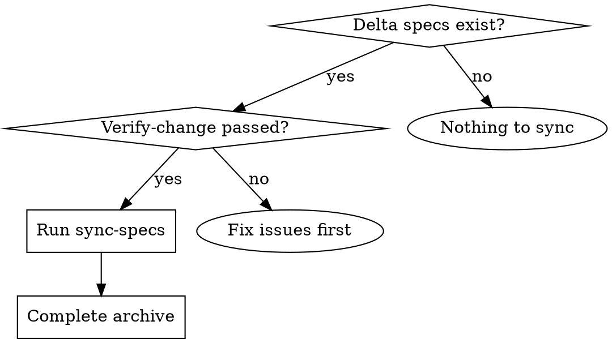

# Sync-Specs — Agent-Driven Intelligent Spec Merging

Merge delta specs from a change into the main specs at `docs/specs/`. This is an **agent-driven** operation — you read delta specs and directly edit main specs to apply changes intelligently.

**Announce at start:** "I'm using the sync-specs skill to merge delta specs into the main spec library."

**Context:** Run after `verify-change` passes (no CRITICAL issues). The change directory is `docs/changes/<name>/`.

---

## When to Use



---

## The Process

### Step 1: Discover Delta Specs

```bash
ls docs/changes/<name>/specs/**/*.md 2>/dev/null
```

Each delta spec maps to a capability: `docs/changes/<name>/specs/<capability>/spec.md`

Main specs live at: `docs/specs/<capability>/spec.md`

### Step 2: For Each Delta Spec, Apply Changes

Read the delta spec, then read the main spec (if it exists), then apply changes.

**Delta spec sections:**

| Section | Action |
|---------|--------|
| `## ADDED Requirements` | Add new requirements to main spec |
| `## MODIFIED Requirements` | Update existing requirements in main spec |
| `## REMOVED Requirements` | Remove requirements from main spec |
| `## RENAMED Requirements` | Rename requirements in main spec (FROM:/TO: format) |

#### ADDED Requirements

```markdown
## ADDED Requirements

### Requirement: New Feature
The system SHALL do something new.

#### Scenario: Basic case
- **WHEN** user does X
- **THEN** system does Y
```

**Action:**
- If requirement doesn't exist in main spec → add it under a `## Requirements` section
- If requirement already exists → update it to match (treat as implicit MODIFIED)
- Add any new scenarios

#### MODIFIED Requirements

```markdown
## MODIFIED Requirements

### Requirement: Existing Feature
#### Scenario: New scenario to add
- **WHEN** user does A
- **THEN** system does B
```

**Action (Intelligent Merging):**
- Find the requirement in main spec
- Add new scenarios — **don't copy existing scenarios that aren't in the delta**
- The delta represents *intent*, not a wholesale replacement
- Preserve all content not mentioned in the delta

#### REMOVED Requirements

```markdown
## REMOVED Requirements

### Requirement: Deprecated Feature
**Reason:** Why removed
**Migration:** What users should do instead
```

**Action:**
- Remove the entire requirement block (header + scenarios) from main spec
- Keep the `**Reason:**` and `**Migration:**` for a deprecation notice (optional)

#### RENAMED Requirements

```markdown
## RENAMED Requirements

- FROM: `### Requirement: Old Name`
- TO: `### Requirement: New Name`
```

**Action:**
- Find the FROM requirement header in main spec
- Change its header to the TO name
- Don't change the content

### Step 3: Create New Main Specs

If a capability doesn't have a main spec yet:

1. Create `docs/specs/<capability>/spec.md`
2. Add a `## Purpose` section — extract from delta spec context, proposal.md, or plan.md. Do NOT use "TBD"
3. Add a `## Requirements` section with the ADDED requirements

### Step 4: Conflict Detection

Before finalizing each merged capability, check for conflicts:

**Conflict types:**
- **Duplicate requirement**: Same requirement name appears twice after merge
- **Conflicting modification**: Delta modifies a requirement that was already modified by a previous change (check git diff for recent changes to the same requirement block)
- **Orphaned reference**: A scenario references a requirement that doesn't exist after merge

**Resolution:**
- If duplicate found → merge into single requirement, combine scenarios
- If conflicting modification found → show both versions to user, ask which to keep
- If orphaned reference found → flag as WARNING, suggest adding the missing requirement

### Step 5: Post-Merge Validation

After all capabilities are merged, validate the resulting main specs:

**Checklist:**
- [ ] No duplicate requirement names within any spec file
- [ ] Every `### Requirement:` has at least one `#### Scenario:` block
- [ ] All SHALL/MUST statements have corresponding scenarios
- [ ] Spec file structure is consistent: Purpose → Requirements → (optional) Scenarios
- [ ] No broken cross-references between requirements and scenarios
- [ ] RENAMED operations didn't leave orphaned references in other parts of the spec

If validation fails, fix the issues before proceeding.

### Step 6: Show Summary

After applying all changes:

```
## Specs Synced: <change-name>

Updated main specs:

**<capability-1>**:
- Added requirement: "New Feature"
- Modified requirement: "Existing Feature" (added 1 scenario)

**<capability-2>**:
- Created new spec file
- Added requirement: "Another Feature"

Ready for archive-change.
```

### Step 7: Idempotency Verification

The operation should be **idempotent** — running twice gives the same result. If re-running, deltas that are already applied will produce no changes.

**Verification:** For each capability that was modified:
1. Re-read the main spec
2. Confirm all delta changes are present
3. Confirm no duplicate or orphaned content was introduced

If any capability fails verification, re-apply the merge for that capability only.

---

## Integration

| Skill | Integration Point |
|-------|-------------------|
| `verify-change` | **Required previous step** — ensures implementation matches specs |
| `archive-change` | **Required next step** — archive the change after syncing |

---

## Red Flags

**Never:**
- Copy/paste the entire delta without reading the main spec first
- Delete content from main spec that isn't mentioned in the delta
- Rename a requirement without verifying the old name actually exists
- Create duplicate requirements (check main spec first)
- Leave a main spec in a broken state (re-read after each capability change)
- Apply changes without user awareness — show what you're doing as you go
- Skip conflict detection — always check for duplicates and conflicting modifications
- Skip post-merge validation — verify spec integrity before proceeding
- Use "TBD" for Purpose in new specs — extract from context instead
