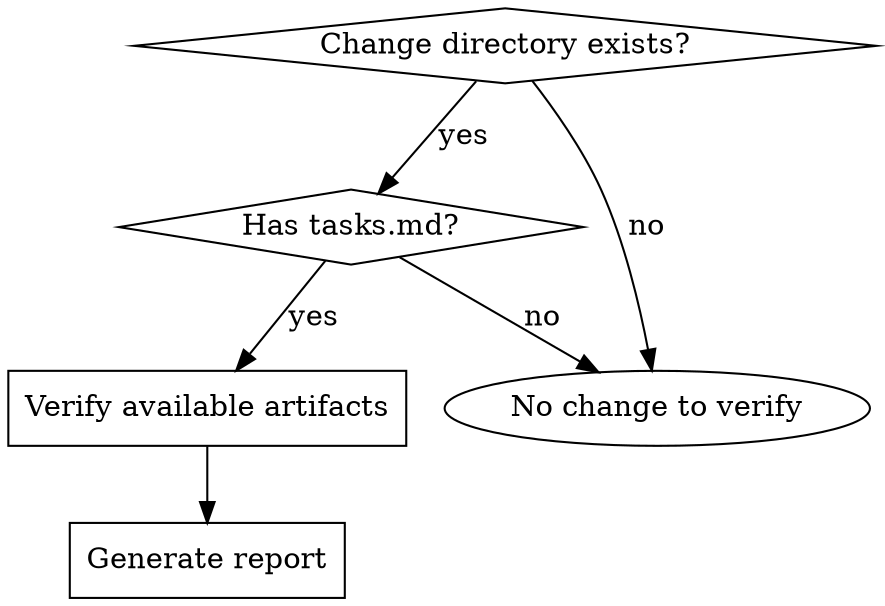

# Verify-Change — 5D Implementation Verification

Validate that an implementation matches the change artifacts using five verification dimensions: Completeness, Correctness, Coherence, Business Flow Integrity, Field Consistency.

**Announce at start:** "I'm using the verify-change skill to validate implementation against the change artifacts."

**Context:** Run after `apply-change` completes implementation. The change directory is `docs/changes/<name>/`.

**Important:** apply-change already performs per-task spec compliance and code quality review. verify-change is a **global integration check** — it verifies cross-task consistency, spec coverage gaps, and design adherence that individual task reviews cannot catch.

**Next step in the current process:** Remind the user to call `sync-specs` (merge delta spec to main spec), then `archive-change`.
---

## When to Use



---

## The Process

### Step 1: Load Artifacts

Read available artifacts from `docs/changes/<name>/`:

| Artifact | Path | Required? |
|----------|------|-----------|
| tasks.md | `docs/changes/<name>/tasks.md` | Required |
| specs/**/*.md | `docs/changes/<name>/specs/**/*.md` | Optional |
| plan.md | `docs/changes/<name>/plan.md` | Optional |
| proposal.md | `docs/changes/<name>/proposal.md` | Optional |

Note what's missing for graceful degradation (Step 8).

### Step 2: Initialize Report

Create a verification report with three dimensions, each scoring CRITICAL / WARNING / SUGGESTION:

**Priority Levels:**
| Priority | Meaning | Action |
|----------|---------|--------|
| **CRITICAL** | Must fix before archive | Blocks completion |
| **WARNING** | Should fix | Recommended |
| **SUGGESTION** | Nice to fix | Optional improvement |

---

### Step 3: Run Verification Dimensions

#### Dimension 1: Completeness

**Task Completion:**
- Read `tasks.md`, parse all checkboxes
- Count: `- [ ]` (incomplete) vs `- [x]` (complete)
- Calculate: `X/Y tasks complete`
- **CRITICAL:** Each incomplete task → `"Task N: <description> — not completed"`
- **Recommendation:** "Complete task" or "Mark as done if already implemented"

**Spec Coverage (if specs exist):**
- Read each spec file in `specs/`
- Extract all requirements (lines starting with `### Requirement:`)
- For each requirement, verify implementation through:
  1. **Test coverage check**: Search test files for tests that verify this requirement. A requirement without a test is incomplete by definition.
  2. **Code review**: Read the implementation files referenced by those tests. Verify the code actually handles the requirement's intent.
  3. **Cross-reference**: If apply-change's subagent reports mention the requirement, check those files too.
- **CRITICAL:** Requirement with no test coverage → `"Requirement not tested: <name>"`
- **WARNING:** Requirement with tests but implementation appears incomplete → `"Implementation may be incomplete: <name>"`
- **Recommendation:** Specific file/line reference, not vague suggestions

#### Dimension 2: Correctness

**Requirement-Implementation Mapping:**
- For each requirement found in specs, examine implementation:
  - Find the implementation file(s) via test references
  - Read the actual code, not just test mocks
  - Assess if behavior matches requirement intent
  - Check edge cases and error handling paths
- **Verification discipline**:
  - Do NOT trust apply-change's subagent reports at face value
  - Read the actual code they wrote
  - Check if tests verify real behavior, not just mock behavior
  - Verify the implementation works for THIS codebase (not a generic solution)
- **WARNING:** If divergence detected → `"Implementation may diverge from spec: <details>"`
- **Recommendation:** Specific file/line review suggestion

**Scenario Coverage:**
- Extract scenarios (`#### Scenario:` blocks) from spec files
- For each scenario:
  - Check code for WHEN condition handling (read actual code paths)
  - Check tests for the scenario (verify tests assert real behavior)
  - Check error/edge case handling
- **WARNING:** Uncovered scenario → `"Scenario not covered: <name>"`
- **Recommendation:** "Add test covering scenario: <description>"

**Integration Correctness (cross-task):**
- Check that independently implemented tasks work together:
  - Shared interfaces match between tasks
  - Data flow between components is consistent
  - No duplicate implementations of the same concern
  - No conflicting patterns (e.g., one task uses async, another sync for same operation)
- **WARNING:** Integration conflict → `"Tasks A and B have conflicting approaches: <details>"`

**Shared Concept Diffusion:**
- Extract business concepts modified by each task:
  - Validation rules (e.g., uniqueness check dimensions, format constraints)
  - Business logic functions (e.g., shared validators, calculators, transformers)
  - State transitions and their triggers
  - Data keys and their semantic meaning
- For each modified concept, scan ALL other tasks for references:
  - Does another task use the same validation function?
  - Does another task depend on the same data key?
  - Does another task trigger the same state transition?
- If a concept was modified in one task but not updated in referencing tasks:
  - **WARNING:** `"Task <N> modified <concept>, but Task <M> still uses the old version at <location>"`
  - **Recommendation:** "Apply the same change to <location> in Task <M>'s scope"

#### Dimension 3: Coherence

**Design Adherence (if plan.md exists):**
- Extract key decisions (`## Key Decisions` section) and architecture (`## Architecture` section)
- For each decision and architecture element, verify implementation follows it:
  - Read implementation code against each decision
  - Cross-check the architecture described in plan.md against the actual code structure
  - Check if architectural choices match the plan
  - Note where implementation deviates and whether the deviation is justified
- **WARNING:** Contradiction → `"Design decision not followed: <decision>"`
- **Recommendation:** "Update implementation or update plan.md to match reality"

**Architectural Consistency:**
- Review new/modified files for:
  - Layer boundaries respected (no business logic in UI layer, etc.)
  - Interface design consistency (similar operations have similar signatures)
  - Error handling strategy consistent across the change
  - Dependency direction follows project architecture
- **SUGGESTION:** Deviation → `"Architectural inconsistency: <details>"`
- **Recommendation:** Specific pattern with example from existing code

**Note:** Do NOT check for:
- Naming conventions (handled by linter/formatter)
- Coding style (handled by prettier/eslint/etc.)
- Whitespace or formatting (handled by auto-formatters)
Focus on **architectural-level** coherence only.

#### Dimension 4: Business Flow Integrity

**Purpose:** Verify that business logic flows correctly from start to finish, with no dead ends, missing transitions, or broken paths. This goes beyond "is the code there" to "does the business process work."

**Extract Business Flows:**
- Read specs, plan.md, and tasks.md for:
  - State machines (e.g., draft → submitted → approved → rejected)
  - Process flows (e.g., order → payment → fulfillment → delivery)
  - Step sequences (e.g., validate → transform → persist → notify)
  - Business rules (e.g., "only admins can approve", "amount > 0 required")

**Flow Completeness:**
- For each identified flow, verify:
  - **Start point exists:** Is there a clear entry point (API endpoint, UI action, event handler)?
  - **End point exists:** Does every flow have a terminal state (success, failure, cancelled)?
  - **No dead ends:** Are there states or steps with no outgoing transitions?
  - **All transitions handled:** For each state change, is there code that performs it?
- **CRITICAL:** Dead end detected → `"Flow '<name>' has no exit from state '<state>'"`
- **CRITICAL:** Missing transition → `"Transition '<from>' → '<to>' not implemented"`

**Exception Paths:**
- Verify error handling and rollback paths:
  - What happens if a step fails? Is there compensation/rollback?
  - Are there timeout or retry mechanisms for external calls?
  - Is partial state handled (e.g., payment succeeded but fulfillment failed)?
- **WARNING:** Missing error path → `"No error handling for step '<step>' in flow '<name>'"`
- **Recommendation:** "Add error handling with rollback/compensation for: <details>"

**Business Rule Enforcement:**
- For each business rule found in specs:
  - Verify the rule is enforced at the correct layer (not just UI validation)
  - Check that bypassing the UI doesn't bypass the rule (API-level enforcement)
  - Verify rule violations produce meaningful error messages
- **CRITICAL:** Rule not enforced → `"Business rule '<rule>' not enforced at API level"`
- **WARNING:** Rule enforced only in UI → `"Rule '<rule>' only validated in frontend, add backend check"`

**Flow Visualization (for complex flows):**
- Draw an ASCII state machine or flow diagram to verify coverage:
  ```
  ┌─────────┐    submit     ┌───────────┐   approve    ┌──────────┐
  │  DRAFT  │ ────────────▶ │ PENDING   │ ──────────▶ │ APPROVED │
  └─────────┘               └───────────┘              └──────────┘
      │                          │
      │ cancel                   │ reject
      ▼                          ▼
  ┌──────────┐            ┌───────────┐
  │ CANCELLED│            │ REJECTED  │
  └──────────┘            └───────────┘
  ```
- Check each arrow (transition) has corresponding code.

#### Dimension 5: Field Consistency

**Purpose:** Track key fields across the entire data flow chain — from input to storage to output — ensuring no fields are lost, renamed, or type-mismatched along the way.

**Identify Key Fields:**
- From specs, design, and tasks, extract fields that matter:
  - User-facing fields (form inputs, display values)
  - Business-critical fields (IDs, amounts, statuses, timestamps)
  - Foreign keys and relationships

**Trace Full Chain:**
For each key field, trace through ALL layers:

```
Frontend Form → API Request → Controller → Service → DAO → Database
                                                    ↓
Frontend Display ← API Response ← Controller ← Service ← DAO
```

**Check at Each Layer:**
| Check | What to Look For | Severity |
|-------|-----------------|----------|
| Field exists | Field present at this layer | CRITICAL if missing |
| Name consistent | Same semantic name (account for naming conventions: camelCase ↔ snake_case) | WARNING if inconsistent |
| Type consistent | string↔string, number↔number, Date↔string (with documented conversion) | CRITICAL if mismatch |
| Required/optional | Frontend required = Backend required (or backend has default) | WARNING if mismatch |
| Validation consistent | Same constraints (max length, range, format) across layers | WARNING if weaker in backend |
| Transformation documented | If field is transformed (e.g., cents ↔ dollars), is it documented and correct? | CRITICAL if undocumented |

**Common Failure Patterns:**
- **Field loss:** Frontend sends `description`, backend receives it but never persists to DB
- **Name drift:** Frontend uses `userName`, backend expects `username`, DB column is `user_name` — all different
- **Type mismatch:** DB stores `BIGINT` for amount, API returns `string`, frontend expects `number`
- **Silent default:** Backend defaults missing field to `null` or `""`, breaking downstream logic
- **Validation gap:** Frontend validates `maxLength: 100`, backend has no limit → DB truncation

**Verification Method:**
1. Pick 3-5 critical fields from the change
2. For each field, grep across all layers:
   - Frontend: form definition, API call, display component
   - Backend: DTO/VO, Controller param, Service method, Entity, Mapper XML
   - Database: column definition, constraints
3. Build a field trace table:

| Field | Frontend | API Request | Service | Entity | DB Column | API Response | Status |
|-------|----------|-------------|---------|--------|-----------|--------------|--------|
| `title` | ✓ form | ✓ body | ✓ param | ✓ property | ✓ column | ✓ response | ✅ |
| `amount` | ✓ form | ✓ body | ✓ param | ✓ property | ✓ column | ✗ missing | ❌ |

- **CRITICAL:** Field missing in chain → `"Field '<name>' lost between <layer A> and <layer B>"`
- **WARNING:** Name or type inconsistency → `"Field '<name>' named '<nameA>' in <layer A>, '<nameB>' in <layer B>"`

---

### Step 4: Multi-Pass Verification

**Do NOT run verification only once.** A single pass misses issues due to context overload and confirmation bias. Run at least **7 passes**: 2 global + 5 focused.

#### Global Passes (2 rounds)

**Pass 1 — Full 5D Scan:**
- Run all five dimensions (Completeness + Correctness + Coherence + Business Flow + Field Consistency)
- Generate initial report with all findings
- This is the "wide net" pass — cast broadly, catch everything

**Pass 2 — Regression Verification:**
- After all CRITICAL issues are fixed
- Re-run the full 5D scan (not just incremental)
- Purpose: confirm fixes didn't break anything else, catch issues missed in Pass 1 due to context overload
- **This is the gate before archive** — no archive until Pass 2 is clean

#### Focused Passes (5 rounds)

Run these between the two global passes, each with a single lens:

**Pass A — Completeness Focus:**
- Only check: tasks completed, requirements implemented, scenarios covered
- Ignore style, design adherence, and minor concerns
- Question: "Did we build everything we said we would?"

**Pass B — Correctness Focus:**
- Only check: requirement-implementation mapping, integration correctness, shared concept diffusion, edge cases
- Read actual code paths, not just test assertions
- Cross-check between independently implemented tasks
- Detect business concepts modified in one task but not propagated to referencing tasks
- Question: "Does everything work correctly together?"

**Pass C — Coherence Focus:**
- Only check: design adherence, architectural consistency, dependency direction
- Ignore missing features and implementation bugs
- Question: "Does the implementation match the design intent?"

**Pass D — Business Flow Focus:**
- Only check: state machines, process flows, exception paths, business rule enforcement
- Draw flow diagrams, verify each transition has code
- Question: "Does the business process work end-to-end?"

**Pass E — Field Consistency Focus:**
- Only check: key field traces across all layers
- Build field trace tables, verify no loss/mismatch
- Question: "Does every critical field survive the full journey?"

#### Execution Order

```
Pass 1 (Full 5D) → Pass A (Completeness) → Pass B (Correctness) → Pass C (Coherence) → Pass D (Business Flow) → Pass E (Field Consistency) → Fix issues → Pass 2 (Full 5D Regression)
```

**Minimum requirement:** All 7 passes must complete before declaring "all clear" — **but only when artifacts are sufficient.** When artifacts are limited, Graceful Degradation (Step 8) takes precedence: check only what the available artifacts support. The 7-pass requirement is conditional on having all artifacts (tasks.md + specs + plan.md).

---

### Step 5: Issues Triage & Fix

After completing the 7 verification passes, triage the findings and take action based on severity.

**CRITICAL issues — must fix before archive:**

Each CRITICAL issue represents a verified defect. Do NOT attempt guess-and-check fixes. Follow the systematic process:

1. **Record issue context** — file path, line number, expected vs actual behavior, related spec requirement
2. **Dispatch `root-cause-debugging` skill** to handle the full fix cycle:
   - Phase 1-3: Investigate root cause (trace data flow, check recent changes, form and test hypotheses)
   - Phase 4: Implement fix with TDD (write failing test → minimal implementation → 3D verification → full test suite)
   - Phase 5: Knowledge capture (update specs, add debug notes, commit with root cause explanation)
3. **Return to verify-change** for Re-Verification (Step 6)

**WARNING issues — should fix before archive:**

- Assess impact: does this warning affect correctness or could it cause future issues?
- If yes → follow the same `root-cause-debugging` process
- If no → document the rationale in the report and proceed to Re-Verification

**SUGGESTION issues — nice to fix:**

- Log them in the report as future improvements
- Do not block the verification flow

---

### Step 6: Re-Verification Flow

After issues have been fixed via `root-cause-debugging` (Step 5), re-run verification:

1. **Read the previous report** — identify which items were CRITICAL/WARNING
2. **Only re-check the previously failed items** — don't re-run the full 3D scan
3. **Verify each fix:**
   - Read the changed code
   - Run the relevant tests
   - Confirm the issue is resolved
4. **Update the report** — mark resolved items, add any new issues found
5. **If new issues discovered during re-verify:** add them at appropriate priority level

**Efficiency rule:** Re-verify is incremental. Full scan only on first run.

---

### Step 7: Generate Report

**Summary Scorecard:**
```
## Verification Report: <change-name>

### Summary
| Dimension         | Status                    |
|-------------------|---------------------------|
| Completeness      | X/Y tasks, N reqs         |
| Correctness       | M/N reqs covered          |
| Coherence         | Followed/Issues           |
| Business Flow     | X flows, Y transitions    |
| Field Consistency | X fields traced, Y issues |

### CRITICAL (Must fix before archive)
- <issue 1>
  → <recommendation>
- <issue 2>
  → <recommendation>

### WARNING (Should fix)
- <issue 1>
  → <recommendation>

### SUGGESTION (Nice to fix)
- <issue 1>
  → <recommendation>

### Final Assessment
- CRITICAL issues: "X critical issue(s) found. Fix before archiving."
- Warnings only: "No critical issues. Y warning(s) to consider."
- All clear: "All checks passed. Ready for archive."
```

**Report format rules:**
- Use markdown with table for summary
- Grouped lists by priority (CRITICAL→WARNING→SUGGESTION)
- Code references: `file.ts:42`
- Every issue MUST have a specific, actionable recommendation
- No vague suggestions like "consider reviewing"
- When uncertain, prefer SUGGESTION over WARNING, WARNING over CRITICAL

---

### Step 8: Graceful Degradation

Run the most complete check possible with available artifacts:

| Available Artifacts | Check Dimensions | Output |
|-------------------|-----------------|--------|
| Only tasks.md | Completeness only | Task completion report |
| tasks.md + specs | Completeness + Correctness | Full spec validation |
| tasks.md + specs + plan | Completeness + Correctness + Coherence + Business Flow | Flow + field validation |
| All artifacts | All 5 dimensions | Full 5D report |

**Always note which checks were skipped and why.**

---

### Step 9: Handoff

Present the report to the user with clear next steps.

**Based on the result, determine the next action:**

```
                          Verification Complete
                                │
           ┌────────────────────┼────────────────────┐
           ▼                    ▼                    ▼
      CRITICAL exists      WARNING only        ALL CLEAR
           │                    │                    │
           ▼                    ▼                    ▼
    root-cause-debugging    fix optional        sync-specs
    (investigate + fix)     root-cause-             │
           │                debugging               ▼
           ▼                    │            archive-change
    re-run verify-change       │
           │                   ▼
           └───────── confirm or skip ─────────▶ archive-change
```

| Result | Next Action | Skills to Invoke |
|--------|------------|------------------|
| **CRITICAL** exists | Triage → Fix → Re-verify | `root-cause-debugging` (investigate & fix) → re-run verify-change |
| **WARNING** only (user chose to fix) | Fix → Re-verify → Archive | `root-cause-debugging` → re-run verify-change → `sync-specs` → `archive-change` |
| **WARNING** only (user chose to skip) | Archive with noted warnings | `sync-specs` → `archive-change` |
| **ALL CLEAR** | Archive | `sync-specs` → `archive-change` |

**Next skill:** `sync-specs` (to merge delta specs into main specs), then `archive-change`.

---

## Integration

| Skill | Integration Point |
|-------|-------------------|
| `apply-change` | **Required previous step** — provides implementation to verify |
| `sync-specs` | **Potential next step** — merges delta specs if all clear |
| `archive-change` | **Potential next step** — archives change if all clear |
| `root-cause-debugging` | **Fix loop** — invoked when CRITICAL/WARNING issues are found, handles investigation + TDD fix + knowledge capture in one flow |

---

## Verification Discipline

**Core principle:** Verify claims against codebase reality before accepting them as truth.

### When Receiving Feedback or Reports

```
WHEN receiving code review feedback or subagent reports:

1. READ: Complete feedback without reacting
2. UNDERSTAND: Restate requirement in own words (or ask)
3. VERIFY: Check against codebase reality
4. EVALUATE: Technically sound for THIS codebase?
5. RESPOND: Technical acknowledgment or reasoned pushback
6. IMPLEMENT: One item at a time, test each
```

### Forbidden Responses

**NEVER:**
- Trust apply-change's subagent reports at face value
- Accept external feedback as orders to follow
- Implement before verifying against actual code
- Performative agreement ("You're absolutely right!")

**INSTEAD:**
- Read the actual code they wrote
- Check if tests verify real behavior, not just mock behavior
- Verify the implementation works for THIS codebase
- Push back with technical reasoning if wrong

### YAGNI Check for Review Suggestions

```
IF reviewer suggests "implementing properly":
  grep codebase for actual usage

  IF unused: "This endpoint isn't called. Remove it (YAGNI)?"
  IF used: Then implement properly
```

### When To Push Back

- Suggestion breaks existing functionality
- Reviewer lacks full context
- Violates YAGNI (unused feature)
- Technically incorrect for this stack
- Conflicts with architectural decisions

**How to push back:** Use technical reasoning, not defensiveness. Reference working tests/code.

---

## Red Flags

**Never:**
- Let a single false positive block completion (use SUGGESTION over WARNING, WARNING over CRITICAL when uncertain)
- Skip checking completeness (it's the most objective dimension)
- Present an issue without an actionable recommendation
- Report tasks as complete without checking actual implementation
- Make claims without evidence — always reference specific files, lines, and code
- Skip graceful degradation (always report what was and wasn't checked and why)
- Trust subagent reports without reading the actual code
- Flag style/formatting issues (use linter/formatter for that)
- Re-run full 5D scan during re-verification (use incremental check)
- Declare "all clear" before completing all 7 verification passes
- Skip any of the 5 focused passes (Completeness, Correctness, Coherence, Business Flow, Field Consistency)
- Skip business flow verification for changes involving state machines or multi-step processes
- Skip field consistency checks for changes involving data input, storage, or display
- Skip `root-cause-debugging` when fixing CRITICAL issues (guess-fix cycles waste more time than systematic debugging)
- Present handoff without mapping each issue to its resolution path
- Return to `apply-change` for fix work — `root-cause-debugging` already has TDD built in, no need to round-trip
