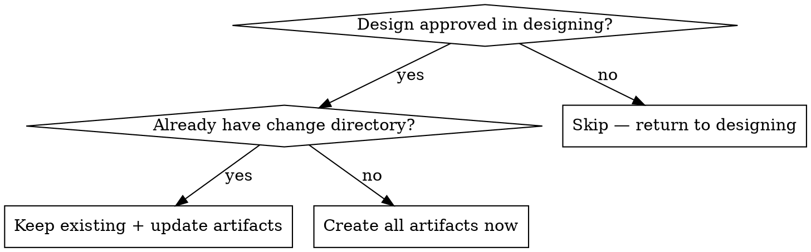

# Write-Plan-Tasks — One-Shot Artifact Generation

Take an approved design and generate all planning artifacts in one step: proposal, specs, design doc, and detailed task list.

**Announce at start:** "I'm using the write-plan-tasks skill to create the implementation plan and artifacts."

**Context:** This skill runs after `designing` user-approves the design. Reads the design doc from `docs/designs/YYYY-MM-DD-<topic>-design.md`.

**Context continuity:** If the design came from an `exploring` phase, the conversation context may contain insights not fully captured in the design doc. Before generating artifacts, quickly scan the exploring discussion for:
- Key decisions made during exploration that aren't in the design doc
- Scope boundaries or non-goals the user explicitly stated
- Codebase patterns or constraints discovered during exploration

Cross-reference these with the design doc's Context section. If important insights are missing, incorporate them into the proposal and plan.md.
**Next step:** Invoke `apply-change` to implement the tasks.

---

## When to Use



---

## Artifact Generation Order

Generate artifacts in this dependency order:

```
proposal.md ──→ specs/**/*.md ──→ plan.md ──→ tasks.md
   (why)           (what)          (how)       (steps)
```

Each artifact depends on the previous ones. Always check existing specs at `docs/specs/` before creating delta specs.

---

## The Process

### Step 0: Setup Change Directory

```bash
mkdir -p docs/changes/<name>/specs
```

**Determine change name** from the design document topic:

| Design Doc Topic | → Change Name |
|-----------------|---------------|
| "Add dark mode" | `add-dark-mode` |
| "Fix login redirect bug" | `fix-login-redirect` |

**Naming rules:** kebab-case, start with verb (add/fix/update/remove/optimize), keep under 50 characters, check `docs/changes/` for existing names to avoid duplicates.

**Check for existing specs** that this change will modify:

```bash
ls docs/specs/ 2>/dev/null
```

### Step 1: Create Proposal

**Read the approved design doc** from `docs/designs/YYYY-MM-DD-<topic>-design.md`.

Extract from the design doc and write `docs/changes/<name>/proposal.md` using the template at `templates/proposal.md`:

| Design Doc Section | → Proposal Section |
|-------------------|-------------------|
| Problem / Goal | → **Why** |
| Architecture + Approach | → **What Changes** |
| Components | → **Capabilities** (New or Modified) |
| Scope | → **Impact** |

**Capabilities section is critical.** Each capability listed here will need a spec file:
- **New Capabilities:** Each creates `specs/<capability>/spec.md`
- **Modified Capabilities:** Each creates a delta spec in `specs/<capability>/spec.md`. Only include if spec-level behavior changes, not just implementation.

Save to: `docs/changes/<name>/proposal.md`

### Step 2: Create Specs

**Before writing any specs, identify all capabilities from the design doc.**

Extract capabilities from these sections of the approved design doc at `docs/designs/YYYY-MM-DD-<topic>-design.md`:

| Design Doc Section | How to Extract Capabilities |
|--------------------|-----------------------------|
| **Architecture** | Each major component = one capability |
| **Components** (if listed) | Each named component = one capability |
| **Data Flow** | Each data processing boundary = one capability |
| **Key Decisions** | A decision that introduces new behavior = check if a capability needs to be created or modified |

**Naming capabilities:** Use the component/domain name in kebab-case. Examples: `auth`, `file-upload`, `notification-service`, `user-preferences`.

**What is NOT a capability (negative list):**
- Internal helper functions or utility modules
- Configuration changes (env vars, feature flags)
- Test-only changes (new test files without production code changes)
- Implementation details that don't change external behavior
- UI styling or layout changes without new user interactions
- Refactoring that preserves existing behavior

**When in doubt:** Ask "Does this change what the system DOES from the user's perspective?" If no, it's not a capability — it's an implementation detail that belongs in tasks.md.

**New vs Modified:**
- Check `docs/specs/` for existing specs
- If capability already has a spec → check if this change adds/modifies its behavior. If yes → **Modified**
- If no existing spec → **New**

**For each capability, write the spec file:**

#### New Capabilities

Create `docs/changes/<name>/specs/<capability>/spec.md` using `templates/delta-spec.md`:

```markdown
## ADDED Requirements

### Requirement: <Name>
The system SHALL <behavior>.

#### Scenario: <Name>
- **WHEN** <condition>
- **THEN** <expected outcome>
```

**Spec writing rules:**
- Each requirement MUST have at least one scenario
- Use SHALL/MUST for normative requirements
- Scenarios use WHEN/THEN format
- Every scenario should be testable
- Each requirement maps to a distinct behavior — if a requirement has more than 3-4 scenarios, consider splitting it

#### Modified Capabilities

Read the existing spec at `docs/specs/<capability>/spec.md`. Create delta spec at `docs/changes/<name>/specs/<capability>/spec.md`:

```markdown
## MODIFIED Requirements

### Requirement: <Name>
<!-- Full updated requirement, matching what will be in main spec after merge -->

#### Scenario: <Name>
- **WHEN** <condition>
- **THEN** <expected outcome>
```

**Delta spec rules:**
- Only include what actually changes. If a requirement already exists and doesn't change, don't include it.
- ADDED/MODIFIED/REMOVED/RENAMED sections are optional — only emit the ones that apply.
- Every modified or added scenario must be testable.
- If a requirement's behavior changes entirely, mark it as MODIFIED (not ADDED).

### Step 3: Create Implementation Plan

Write `docs/changes/<name>/plan.md` using the template at `templates/plan.md`. This is the **primary architectural reference** for implementer subagents in apply-change — they read this to understand how the system fits together and why decisions were made. (The task-specific instructions come from `tasks.md`; plan.md provides the context to make those instructions make sense.)

**Boundary with tasks.md:** plan.md explains **why** the system is organized this way (architecture decisions, dependency reasoning, scope definitions). tasks.md contains **what exactly to do** (file paths, code snippets, commands, step-by-step instructions). If a subagent needs to understand a decision, read plan.md. If it needs to know which file to edit and what code to write, read tasks.md. When in conflict, tasks.md is the execution authority.

Extract these from the approved design doc and write a complete, self-contained plan:

| Section | What to Extract | Why Plan.md Needs It |
|---------|----------------|----------------------|
| **Context** | 2-4 sentence summary: what's being built, why, current state, constraints | Grounds subagent in the problem space |
| **Architecture** | High-level architecture: components, connections, data flow, key abstractions | Gives subagent a mental model of the system |
| **Decisions** | Key technical decisions with full rationale (not just what, but why) | Subagents need the reasoning to handle ambiguous edge cases |
| **Files** | List of files to create/modify, grouped by component, with exact paths | Tells subagent where to work |
| **Implementation Order** | Which components to build first, with dependency reasoning | Prevents dependency deadlocks in task execution |
| **Cross-Cutting** | Error handling, logging, security, config patterns | Ensures consistent implementation across all tasks |
| **Testing Strategy** | Unit vs integration split, mocking approach, test fixtures | Aligns test writing across independent subagents |

**Write each section with enough detail for a subagent to work independently.** The plan.md is the implementer's primary reference. For most tasks it should be sufficient on its own. For deep context, include a `## Reference` section with a link back to the original design doc at `docs/designs/YYYY-MM-DD-<topic>-design.md`.

**Architecture section guidance:** Don't just list components. Describe how they connect, data flow direction, key interfaces. If there's a diagram in the design doc, describe it in prose. **Include key type/interface signatures** where they affect component boundaries — for example, whether `S3Service.putObject()` takes a `Buffer` or `Stream` is an architecture-level decision that subagents must know.

**Decisions section guidance:** Include reasoning, not just outcomes. "Use Redis (because data must survive process restarts and we already have Redis in the stack)" is better than "Use Redis." If alternatives were considered, note why they were rejected — this prevents subagents from re-litigating closed decisions.

**Implementation Order guidance:**
- Start with independent leaf components (no internal dependencies)
- End with integration/glue code that wires components together
- If testing strategy differs by component, note it per-file group
- **For each entry, define scope**: what this step covers and what it explicitly leaves for later steps. This prevents subagents from over-building or under-building.

**No line limit.** The previous 40-line constraint (from the older design quick-reference format) is removed. Provide the detail implementers need.

### Step 4: Create Tasks

Write `docs/changes/<name>/tasks.md` — this is the **detailed implementation plan** with granular task breakdown.

**Each task is one action (2-5 minutes):**
- "Write the failing test" — task
- "Run it to make sure it fails" — task
- "Implement minimal code to pass" — task
- "Run tests to verify" — task
- "Commit" — task

**Before defining tasks, map out file structure:**

```
docs/changes/<name>/
├── proposal.md
├── specs/<domain>/spec.md
├── plan.md
└── tasks.md            ← you are here
```

List which files will be created or modified and what each is responsible for. This decomposition feeds into the task breakdown.

**Task format using template at `templates/tasks.md`:**

```markdown
## 1. <Component Name>

**Files:**
- Create: `src/path/to/file.ts`
- Modify: `src/path/to/existing.ts`
- Test: `tests/path/to/test.ts`

- [ ] **1.1 Write the failing test**

```typescript
test('specific behavior', () => {
  const result = functionUnderTest(input);
  expect(result).toBe(expected);
});
```

- [ ] **1.2 Run test to verify it fails**

Run: `npm test -- tests/path/test.ts`
Expected: FAIL — "function not defined"

- [ ] **1.3 Write minimal implementation**

```typescript
export function functionUnderTest(input: Type): ReturnType {
  return expected;
}
```

- [ ] **1.4 Run test to verify it passes**

Run: `npm test -- tests/path/test.ts`
Expected: PASS


```

**No placeholders.** Every step must contain actual content:
- ❌ "TBD", "TODO", "implement later"
- ❌ "Add appropriate error handling" (what exactly?)
- ❌ "Write tests for the above" (what tests?)
- ❌ "Similar to Task N" (repeat it)
- ✅ Complete code, exact file paths, exact commands

### Step 5: Artifact Self-Review & Independent Review

After writing all artifacts, run two phases of review: a quick self-check for surface issues, then an independent subagent review against the original design doc.

**Why two phases:** The first catches typos/formatting/obvious gaps. The second catches structural problems (design drift, missed capabilities, wrong decomposition) that the creator is blind to due to context immersion.

---

#### Phase 1: Self-Review (Quick)

Run these checks yourself:

**1. Spec coverage:** Can you point to a task that implements each requirement in the specs?

**2. Placeholder scan:** Any "TBD", "TODO", or vague instructions in tasks.md? Fix them.

**3. Type consistency:** Do types/method signatures from later tasks match earlier ones?

**4. Cross-reference check:** Do paths referenced in tasks.md match actual file structure?

**5. Task boundary check:** Are any tasks too large (>5 files) or too small (trivial)? Adjust.

Fix any issues inline. These are mechanical — no re-review needed.

---

#### Phase 2: Independent Artifact Review (Deep)

Dispatch a reviewer subagent with the original design doc and all four artifacts.

**Dispatch template:**

```markdown
## Objective
Review artifacts at `docs/changes/<name>/` for correctness, completeness, and
architecture soundness against the original design doc.

## Original Design Doc

<Paste full text of `docs/designs/YYYY-MM-DD-<topic>-design.md`>

## Artifact Paths

| Artifact | Path |
|----------|------|
| Proposal | `docs/changes/<name>/proposal.md` |
| Specs | `docs/changes/<name>/specs/**/*.md` |
| Plan | `docs/changes/<name>/plan.md` |
| Tasks | `docs/changes/<name>/tasks.md` |

## What to Check

**Design Coverage:**
- Does the proposal capture the full scope, problem, and approach from the design doc?
- Are any capabilities from the design doc missing from the artifacts?
- Are any scope boundaries (explicit non-goals) being violated?

**Spec Completeness:**
- Does every capability identified in the design doc have a corresponding spec file?
- Is each spec requirement testable? (WHEN/THEN scenarios)
- Are edge cases and error conditions covered in the specs?

**Design Faithfulness:**
- Does `plan.md` accurately reflect the architecture, key decisions, and file structure from the design doc?
- Is any important architectural context lost in the extraction from design doc to plan?
- Are file paths, component names, and data flows consistent with the design?

**Task Decomposition:**
- Are task boundaries clean? (Each task = one component/file group)
- Is the implementation order logical? (dependencies first)
- Are task descriptions precise enough for a subagent to implement without ambiguity?

**Architecture Soundness (scope-limited):**
- Any obvious architectural issues in the artifact design?
- Does the design follow project conventions?
- Is there any sign of over-engineering (too many abstractions for the scope)?
- Is there any sign of under-engineering (no error handling strategy)?

## Report Format

When done, report:

### Issues Found

| Severity | Category | Location | Description |
|----------|----------|----------|-------------|
| CRITICAL | Design coverage | proposal.md | Missing capability: <name> |
| WARNING | Spec completeness | specs/auth/spec.md | No error scenario for token expiry |
| SUGGESTION | Task decomposition | tasks.md:5.3 | Task could be split: <reason> |

### Summary
- **CRITICAL issues:** N (must fix before apply-change)
- **WARNINGS:** N
- **SUGGESTIONS:** N
```

**After review completes:**

1. If CRITICAL issues: fix each, then re-dispatch reviewer to confirm fixes (incremental, re-check only previously flagged items)
2. If WARNINGs only: fix before proceeding (no re-review needed)
3. If SUGGESTIONs only: fix optionally, proceed either way

**Do NOT skip this phase.** The subagent brings a fresh perspective uncorrupted by artifact creation — it catches things the creator cannot see.

### Step 6: Handoff

**Designate a `change_id` for use by downstream skills.** The change name is the directory name under `docs/changes/`.

Announce: "All artifacts created at `docs/changes/<name>/`. Ready for implementation."

**Next step:** Invoke `apply-change` to implement the tasks.

---

## Integration

| Skill | Integration Point |
|-------|-------------------|
| `designing` | **Required previous step** — provides approved design |
| `apply-change` | **Required next step** — implements tasks |
| `templates/proposal.md` | Proposal template |
| `templates/delta-spec.md` | Spec template |
| `templates/plan.md` | Implementation plan template |
| `templates/tasks.md` | Tasks template |

---

## Red Flags

**Never:**
- Leave placeholders (TBD, TODO) in any artifact
- Create tasks without exact file paths and code
- Include implementation details in specs (specs = what, not how)
- Modify main specs directly (always use delta specs in `docs/changes/<name>/specs/`)
- Skip creating any artifact (all four are required)
- Skip the independent artifact review (Phase 2 in Step 5) — it catches what the creator is blind to
- Skip fixing CRITICAL issues found in Phase 2 (must fix, then re-review)
- Combine Phase 2 review into your own self-review (defeats the purpose of fresh context)
- Reference files or types not defined in any task
- Create task groups that bundle unrelated work
