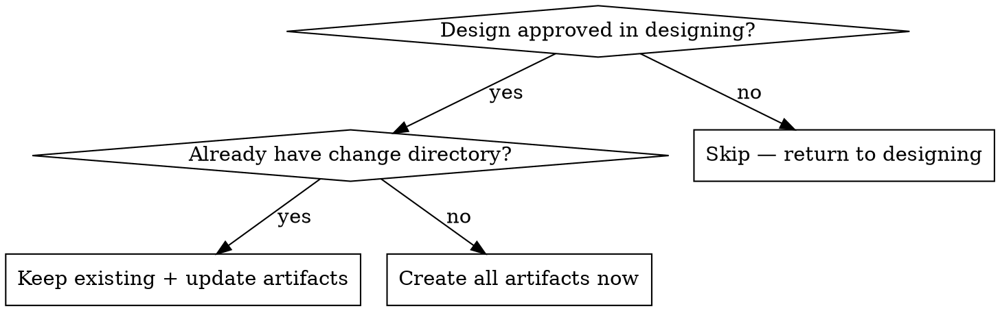

# Write-Plan-Tasks — Specs & Task Artifact Generation

Take an approved design and generate all planning artifacts in one step: specs and detailed task list.

**Announce at start:** "I'm using the write-plan-tasks skill to create the implementation specs and tasks."

**Context:** This skill runs after `designing` user-approves the design. Reads the design doc from `docs/designs/YYYY-MM-DD-<topic>-design.md`.

**Context continuity:** If the design came from an `exploring` phase, the conversation context may contain insights not fully captured in the design doc. Before generating artifacts, quickly scan the exploring discussion for:
- Key decisions made during exploration that aren't in the design doc
- Scope boundaries or non-goals the user explicitly stated
- Codebase patterns or constraints discovered during exploration

Cross-reference these with the design doc's Context section. If important insights are missing, incorporate them into the tasks.md header sections.
**Next step:** Invoke `apply-change` to implement the tasks.

---

## When to Use


```dot
digraph when_to_use {
    "Design approved in designing?" [shape=diamond];
    "Already have change directory?" [shape=diamond];
    "Keep existing + update artifacts" [shape=box];
    "Create all artifacts now" [shape=box];
    "Skip — return to designing" [shape=box];

    "Design approved in designing?" -> "Already have change directory?" [label="yes"];
    "Design approved in designing?" -> "Skip — return to designing" [label="no"];
    "Already have change directory?" -> "Keep existing + update artifacts" [label="yes"];
    "Already have change directory?" -> "Create all artifacts now" [label="no"];
}
```

---

## Artifact Generation Order

Generate artifacts in this dependency order:

```
1.specs/**/*.md ──→ 2.tasks.md
   (what)            (how + steps)
```

Each artifact depends on the previous one. Always check existing specs at `docs/specs/` before creating delta specs.

---

## The Process

### Step 0: Setup Change Directory

```bash
mkdir -p docs/changes/<name>/1.specs
```

**Determine change name** from the design document topic:

| Design Doc Topic | → Change Name |
|-----------------|---------------|
| "Add dark mode" | `add-dark-mode` |
| "Fix login redirect bug" | `fix-login-redirect` |

**Naming rules:** kebab-case, start with verb (add/fix/update/remove/optimize), keep under 50 characters, check `docs/changes/` for existing names to avoid duplicates.

**Check for existing specs** that this change will modify:

```bash
ls docs/specs/ 2>/dev/null
```

### Step 1: Create Specs

**Before writing any specs, identify all capabilities from the design doc.**

Extract capabilities from these sections of the approved design doc at `docs/designs/YYYY-MM-DD-<topic>-design.md`:

| Design Doc Section | How to Extract Capabilities |
|--------------------|-----------------------------|
| **Architecture** | Each major component = one capability |
| **Components** (if listed) | Each named component = one capability |
| **Data Flow** | Each data processing boundary = one capability |
| **Key Decisions** | A decision that introduces new behavior = check if a capability needs to be created or modified |

**Naming capabilities:** Use the component/domain name in kebab-case. Examples: `auth`, `file-upload`, `notification-service`, `user-preferences`.

**What is NOT a capability (negative list):**
- Internal helper functions or utility modules
- Configuration changes (env vars, feature flags)
- Test-only changes (new test files without production code changes)
- Implementation details that don't change external behavior
- UI styling or layout changes without new user interactions
- Refactoring that preserves existing behavior

**When in doubt:** Ask "Does this change what the system DOES from the user's perspective?" If no, it's not a capability — it's an implementation detail that belongs in tasks.md.

**New vs Modified:**
- Check `docs/specs/` for existing specs
- If capability already has a spec → check if this change adds/modifies its behavior. If yes → **Modified**
- If no existing spec → **New**

**For each capability, write the spec file:**

#### New Capabilities

Create `docs/changes/<name>/1.specs/<capability>/spec.md` using `templates/1.delta-spec.md`:

```markdown
## ADDED Requirements

### Requirement: <Name>
The system SHALL <behavior>.

#### Scenario: <Name>
- **WHEN** <condition>
- **THEN** <expected outcome>
```

**Spec writing rules:**
- Each requirement MUST have at least one scenario
- Use SHALL/MUST for normative requirements
- Scenarios use WHEN/THEN format
- Every scenario should be testable
- Each requirement maps to a distinct behavior — if a requirement has more than 3-4 scenarios, consider splitting it

#### Modified Capabilities

Read the existing spec at `docs/specs/<capability>/spec.md`. Create delta spec at `docs/changes/<name>/1.specs/<capability>/spec.md`:

```markdown
## MODIFIED Requirements

### Requirement: <Name>
<!-- Full updated requirement, matching what will be in main spec after merge -->

#### Scenario: <Name>
- **WHEN** <condition>
- **THEN** <expected outcome>
```

**Delta spec rules:**
- Only include what actually changes. If a requirement already exists and doesn't change, don't include it.
- ADDED/MODIFIED/REMOVED/RENAMED sections are optional — only emit the ones that apply.
- Every modified or added scenario must be testable.
- If a requirement's behavior changes entirely, mark it as MODIFIED (not ADDED).

### Step 2: Create Tasks

Write `docs/changes/<name>/2.tasks.md` using the template at `templates/2.tasks.md`.

The template has two parts: a **header** with planning context (9 sections) and the **task list** with granular task breakdown.

#### Header Sections

The template has two parts: a **header** with planning context (9 sections) and the **task list** with granular task breakdown.

**Capabilities** — List of new and modified capabilities (extracted during Step 1). This is the index that maps specs to tasks.

**Context** — Problem background and constraints. Four sub-sections:
- *Change Background*: 1-2 sentences on what problem we're solving and why.
- *Current State*: 1-2 sentences on what exists now and what's missing.
- *Constraints*: 1-2 sentences on technical/business constraints and scope boundaries.
- *References*: Links to design doc and specs. Include base package.

**Domain Context** — Business domain background that subagents need to understand the WHY behind the WHAT. Three sub-sections:
- *Key Concepts*: Define domain terms, acronyms, and business entities. Subagents must understand what things MEAN, not just their names. Include format constraints and data sources.
- *Business Flow Position*: Where this change sits in the larger business pipeline. Use an ASCII diagram or step list. Subagents need to know "I am step N of M" to avoid breaking upstream/downstream assumptions.
- *Data Semantics*: Key data entities, their relationships, and field-level semantics. This prevents subagents from misinterpreting field purposes or breaking implicit contracts.

**Architecture** — High-level architecture description: components, connections, data flow, key interfaces. Include key type/interface signatures where they affect component boundaries. Two sub-sections:
- *Component Responsibilities*: Brief (1-2 sentences) description of what EACH component does. Prevents subagents from putting logic in the wrong component.
- *Key Interfaces*: Precise interface/method signatures at component boundaries, with parameter types, return types, and semantic meaning.
If there's a diagram in the design doc, reproduce or adapt it here.

**Reference Code** — Concrete code snippets extracted from the existing codebase that subagents should mimic. DO NOT describe patterns in prose — show the actual code. Each snippet should be labeled with the pattern it demonstrates (e.g., "ServiceImpl Error Handling Pattern", "DTO Assembly Pattern"). Extract real code from the project that matches the Cross-Cutting Concerns rules. This bridges the gap between "what the rule says" and "what the code actually looks like" in this project.

**Implementation Order** — Component-level sequence with dependency reasoning. Mark components that can be implemented in parallel. Use the table format from the template.

**Cross-Cutting Concerns** — Error handling, logging, security, config patterns, coding conventions that apply across all tasks. Each sub-section (Error Handling, Logging, Configuration, Coding Conventions) must contain enough detail for a subagent to follow without guessing. When possible, reference the Reference Code section for concrete examples.

**Configuration** — Environment variables, feature flags, external service URLs, and other shared configuration. Include name, type, default value, and required/optional status. If few items, merge into Cross-Cutting Concerns instead.

**Testing Strategy** — Test approach, framework, run commands, and mocking strategy. Per-component differences if applicable. Three sub-sections:
- *Test Framework & Commands*: Framework name, exact run command, coverage tool.
- *Mocking Strategy*: What to mock vs what not to mock, fixture location.
- *Per-Component Notes*: Component-specific testing considerations.

**Reference** — Link back to the original design doc at `docs/designs/YYYY-MM-DD-<topic>-design.md`.

#### Header guidance

The template defines sub-structure for each section — **fill every sub-section, do not leave them empty**. The sub-structure IS the minimum fill standard. Subagents need concrete, specific context — vague descriptions like "follow best practices" or "use standard patterns" are not useful.

Key principles:
- **Show, don't tell:** Reference Code section uses real code, not prose descriptions of patterns
- **Semantic precision:** Key Concepts must explain what terms MEAN in this domain, not just define them technically
- **Flow awareness:** Business Flow Position must show where the change sits in the larger pipeline
- **Interface precision:** Key Interfaces must include types + semantic meaning, not just method names
- **Context completeness:** Every Cross-Cutting sub-section must contain enough for a subagent to follow without external research

#### Task List

**Before defining tasks, map out file structure:**

```
docs/changes/<name>/
├── 1.specs/<domain>/spec.md
└── 2.tasks.md            ← you are here
```

List which files will be created or modified and what each is responsible for. This decomposition feeds into the task breakdown.

**Each task is one action (2-5 minutes):**
- "Write the failing test" — task
- "Run it to make sure it fails" — task
- "Implement minimal code to pass" — task
- "Run tests to verify" — task
- "Commit" — task

**Task format using template at `templates/2.tasks.md`:**

```markdown
### 1. <Component Name>

**Files:**
- Create: `src/path/to/file.ts`
- Modify: `src/path/to/existing.ts`
- Test: `tests/path/to/test.ts`

- [ ] **1.1 Write the failing test**

```typescript
test('specific behavior', () => {
  const result = functionUnderTest(input);
  expect(result).toBe(expected);
});
```

- [ ] **1.2 Run test to verify it fails**

Run: `npm test -- tests/path/test.ts`
Expected: FAIL — "function not defined"

- [ ] **1.3 Write minimal implementation**

```typescript
export function functionUnderTest(input: Type): ReturnType {
  return expected;
}
```

- [ ] **1.4 Run test to verify it passes**

Run: `npm test -- tests/path/test.ts`
Expected: PASS
```

**No placeholders.** Every step must contain actual content:
- ❌ "TBD", "TODO", "implement later"
- ❌ "Add appropriate error handling" (what exactly?)
- ❌ "Write tests for the above" (what tests?)
- ❌ "Similar to Task N" (repeat it)
- ✅ Complete code, exact file paths, exact commands

### Step 3: Artifact Self-Review & Independent Review

After writing all artifacts, run two phases of review: a quick self-check for surface issues, then an independent subagent review against the original design doc.

**Why two phases:** The first catches typos/formatting/obvious gaps. The second catches structural problems (design drift, missed capabilities, wrong decomposition) that the creator is blind to due to context immersion.

---

#### Phase 1: Self-Review (Quick)

Run these checks yourself:

**1. Spec coverage:** Can you point to a task that implements each requirement in the specs?

**2. Placeholder scan:** Any "TBD", "TODO", or vague instructions in tasks.md? Fix them.

**3. Type consistency:** Do types/method signatures from later tasks match earlier ones?

**4. Cross-reference check:** Do paths referenced in tasks.md match actual file structure?

**5. Task boundary check:** Are any tasks too large (>5 files) or too small (trivial)? Adjust.

Fix any issues inline. These are mechanical — no re-review needed.

---

#### Phase 2: Independent Artifact Review (Deep)

Dispatch a reviewer subagent with the original design doc and both artifacts.

**Dispatch template:**

```markdown
## Objective
Review artifacts at `docs/changes/<name>/` for correctness, completeness, and
architecture soundness against the original design doc.

## Original Design Doc

<Paste full text of `docs/designs/YYYY-MM-DD-<topic>-design.md`>

## Artifact Paths

| Artifact | Path |
|----------|------|
| Specs | `docs/changes/<name>/1.specs/**/*.md` |
| Tasks | `docs/changes/<name>/2.tasks.md` |

## What to Check

**Design Coverage:**
- Are any capabilities from the design doc missing from the artifacts?
- Are any scope boundaries (explicit non-goals) being violated?

**Spec Completeness:**
- Does every capability identified in the design doc have a corresponding spec file?
- Is each spec requirement testable? (WHEN/THEN scenarios)
- Are edge cases and error conditions covered in the specs?

**Design Faithfulness:**
- Does tasks.md accurately reflect the architecture, decisions, and constraints from the design doc?
- Is any important architectural context lost in the extraction from design doc to tasks?
- Are file paths, component names, and data flows consistent with the design?

**Task Decomposition:**
- Are task boundaries clean? (Each task = one component/file group)
- Is the implementation order logical? (dependencies first)
- Are task descriptions precise enough for a subagent to implement without ambiguity?

**Architecture Soundness (scope-limited):**
- Any obvious architectural issues in the artifact design?
- Does the design follow project conventions?
- Is there any sign of over-engineering (too many abstractions for the scope)?
- Is there any sign of under-engineering (no error handling strategy)?

## Report Format

When done, report:

### Issues Found

| Severity | Category | Location | Description |
|----------|----------|----------|-------------|
| CRITICAL | Design coverage | tasks.md | Missing capability: <name> |
| WARNING | Spec completeness | specs/auth/spec.md | No error scenario for token expiry |
| SUGGESTION | Task decomposition | tasks.md:5.3 | Task could be split: <reason> |

### Summary
- **CRITICAL issues:** N (must fix before apply-change)
- **WARNINGS:** N
- **SUGGESTIONS:** N
```

**After review completes:**

1. If CRITICAL issues: fix each, then re-dispatch reviewer to confirm fixes (incremental, re-check only previously flagged items)
2. If WARNINGs only: fix before proceeding (no re-review needed)
3. If SUGGESTIONs only: fix optionally, proceed either way

**Do NOT skip this phase.** The subagent brings a fresh perspective uncorrupted by artifact creation — it catches things the creator cannot see.

### Step 4: Handoff

**Designate a `change_id` for use by downstream skills.** The change name is the directory name under `docs/changes/`.

Announce: "All artifacts created at `docs/changes/<name>/`. Ready for implementation."

**Next step:** Invoke `apply-change` to implement the tasks.

---

## Integration

| Skill | Integration Point |
|-------|-------------------|
| `designing` | **Required previous step** — provides approved design |
| `apply-change` | **Required next step** — implements tasks |
| `templates/1.delta-spec.md` | Spec template |
| `templates/2.tasks.md` | Tasks template |

---

## Red Flags

**Never:**
- Leave placeholders (TBD, TODO) in any artifact
- Create tasks without exact file paths and code
- Include implementation details in specs (specs = what, not how)
- Modify main specs directly (always use delta specs in `docs/changes/<name>/1.specs/`)
- Skip creating any artifact (both are required)
- Skip the independent artifact review (Phase 2 in Step 3) — it catches what the creator is blind to
- Skip fixing CRITICAL issues found in Phase 2 (must fix, then re-review)
- Combine Phase 2 review into your own self-review (defeats the purpose of fresh context)
- Reference files or types not defined in any task
- Create task groups that bundle unrelated work
